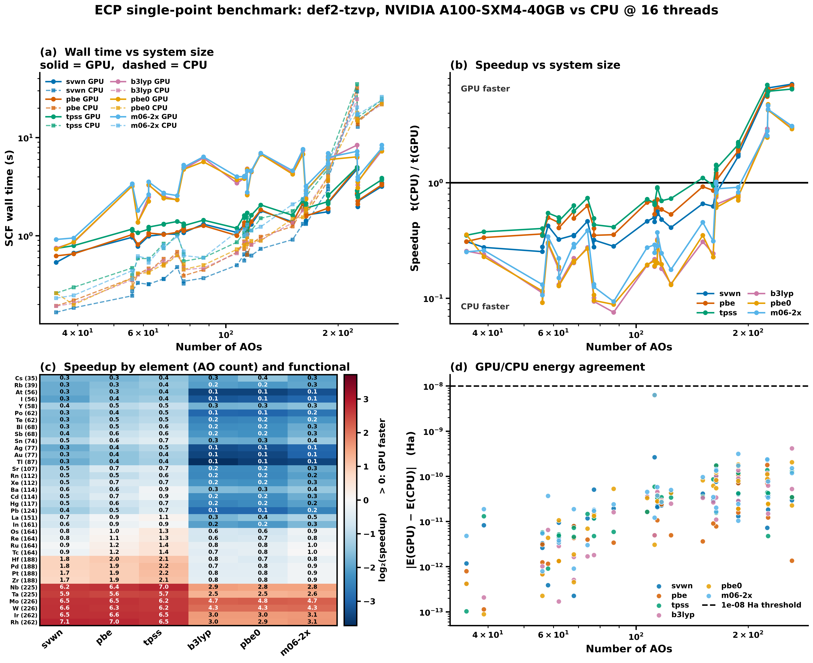

# ECP single-point benchmark: GPU4PySCF vs PySCF

One closed-shell compound per element carrying a def2-ECP (36 elements), each run with 6 functionals on both devices.

> [!NOTE]
> Geometries are idealized VSEPR shapes with tabulated bond lengths, not optimized. Both devices see identical coordinates, so GPU/CPU comparisons are exact; the absolute energies are not thermochemical reference values.

## Settings

| key | value |
|---|---|
| basis | `def2-tzvp` |
| grid | `[75, 302]` |
| conv_tol | `1e-09` |
| max_cycle | `100` |
| cpu_threads | `16` |
| repeat | `1` |
| gpu | `NVIDIA A100-SXM4-40GB` |
| contract_engine | `cupy` |
| cupy | `13.6.0` |
| pyscf | `2.13.0` |
| gpu4pyscf | `1.8.1` |
| git_commit | `70d0a1045` |
| hostname | `nid001601` |
| slurm_job_id | `58176710` |
| timestamp | `2026-09-11T14:33:32-0700` |
| functionals | `svwn pbe tpss b3lyp pbe0 m06-2x` |

CPU references are built fresh from the Mole (`pyscf.dft.RKS`), never via `to_cpu()` of a converged GPU object -- that inherits the GPU density and biases CPU timings low by ~6x.

## GPU vs CPU energy agreement

Worst |E_GPU - E_CPU| across functionals, per system. Threshold 1e-08 Ha.

| element | compound | chg | natm | nao | max abs dE (Ha) | worst functional | status |
|---|---|---:|---:|---:|---:|---|---|
| Rb | RbH | +0 | 2 | 39 | 1.89e-11 | m06-2x | ok |
| Sr | SrCl2 | +0 | 3 | 107 | 4.55e-11 | m06-2x | ok |
| Y | YH3 | +0 | 4 | 58 | 3.68e-11 | m06-2x | ok |
| Zr | ZrCl4 | +0 | 5 | 188 | 1.73e-10 | m06-2x | ok |
| Nb | NbCl5 | +0 | 6 | 225 | 2.28e-10 | m06-2x | ok |
| Mo | MoF6 | +0 | 7 | 226 | 7.78e-11 | m06-2x | ok |
| Tc | TcO4- | -1 | 5 | 164 | 1.70e-10 | pbe | ok |
| Ru | RuO4 | +0 | 5 | 164 | 1.75e-10 | tpss | ok |
| Rh | RhCl6_3- | -3 | 7 | 262 | 2.05e-10 | pbe0 | ok |
| Pd | PdCl4_2- | -2 | 5 | 188 | 1.19e-10 | tpss | ok |
| Ag | AgCl | +0 | 2 | 77 | 1.83e-11 | m06-2x | ok |
| Cd | CdCl2 | +0 | 3 | 114 | 4.18e-11 | b3lyp | ok |
| In | InCl3 | +0 | 4 | 161 | 8.62e-11 | tpss | ok |
| Sn | SnH4 | +0 | 5 | 74 | 1.47e-11 | tpss | ok |
| Sb | SbH3 | +0 | 4 | 68 | 7.28e-12 | tpss | ok |
| Te | H2Te | +0 | 3 | 62 | 1.07e-11 | pbe0 | ok |
| I | HI | +0 | 2 | 56 | 5.51e-12 | tpss | ok |
| Xe | XeF2 | +0 | 3 | 112 | 6.36e-09 | m06-2x | ok |
| Cs | CsH | +0 | 2 | 35 | 4.81e-12 | m06-2x | ok |
| Ba | BaCl2 | +0 | 3 | 114 | 5.80e-11 | m06-2x | ok |
| La | LaCl3 | +0 | 4 | 151 | 9.69e-11 | m06-2x | ok |
| Hf | HfCl4 | +0 | 5 | 188 | 3.15e-10 | m06-2x | ok |
| Ta | TaCl5 | +0 | 6 | 225 | 2.38e-10 | m06-2x | ok |
| W | WF6 | +0 | 7 | 226 | 8.64e-11 | pbe | ok |
| Re | ReO4- | -1 | 5 | 164 | 1.08e-10 | svwn | ok |
| Os | OsO4 | +0 | 5 | 164 | 1.35e-10 | m06-2x | ok |
| Ir | IrCl6_3- | -3 | 7 | 262 | 4.18e-10 | b3lyp | ok |
| Pt | PtCl4_2- | -2 | 5 | 188 | 9.00e-11 | b3lyp | ok |
| Au | AuCl | +0 | 2 | 77 | 5.08e-11 | svwn | ok |
| Hg | HgCl2 | +0 | 3 | 117 | 3.46e-11 | tpss | ok |
| Tl | TlCl | +0 | 2 | 87 | 5.32e-11 | pbe0 | ok |
| Pb | PbCl2 | +0 | 3 | 124 | 5.00e-11 | m06-2x | ok |
| Bi | BiH3 | +0 | 4 | 68 | 1.89e-11 | m06-2x | ok |
| Po | H2Po | +0 | 3 | 62 | 4.89e-12 | tpss | ok |
| At | HAt | +0 | 2 | 56 | 5.80e-12 | tpss | ok |
| Rn | RnF2 | +0 | 3 | 112 | 2.66e-10 | svwn | ok |

## Speedup (CPU wall time / GPU wall time)

CPU at 16 threads, single GPU. Values below 1.00 mean the CPU was faster.

| element | compound | nao | svwn | pbe | tpss | b3lyp | pbe0 | m06-2x | mean |
|---|---|---:|---:|---:|---:|---:|---:|---:|---:|
| Rb | RbH | 39 | 0.28 | 0.34 | 0.38 | 0.24 | 0.23 | 0.26 | 0.29 |
| Sr | SrCl2 | 107 | 0.46 | 0.68 | 0.72 | 0.19 | 0.20 | 0.27 | 0.42 |
| Y | YH3 | 58 | 0.42 | 0.50 | 0.55 | 0.29 | 0.30 | 0.34 | 0.40 |
| Zr | ZrCl4 | 188 | 1.69 | 1.89 | 2.14 | 0.78 | 0.78 | 0.91 | 1.37 |
| Nb | NbCl5 | 225 | 6.19 | 6.42 | 7.02 | 2.94 | 2.82 | 2.80 | 4.70 |
| Mo | MoF6 | 226 | 6.51 | 6.51 | 6.19 | 4.66 | 4.78 | 4.68 | 5.55 |
| Tc | TcO4- | 164 | 0.88 | 1.22 | 1.43 | 0.75 | 0.80 | 1.02 | 1.02 |
| Ru | RuO4 | 164 | 0.94 | 1.17 | 1.41 | 0.79 | 0.78 | 0.98 | 1.01 |
| Rh | RhCl6_3- | 262 | 7.14 | 6.98 | 6.47 | 2.97 | 2.92 | 3.10 | 4.93 |
| Pd | PdCl4_2- | 188 | 1.79 | 1.88 | 2.25 | 0.74 | 0.77 | 0.92 | 1.39 |
| Ag | AgCl | 77 | 0.28 | 0.40 | 0.49 | 0.10 | 0.11 | 0.13 | 0.25 |
| Cd | CdCl2 | 114 | 0.54 | 0.72 | 0.90 | 0.20 | 0.20 | 0.28 | 0.47 |
| In | InCl3 | 161 | 0.63 | 0.86 | 0.95 | 0.24 | 0.23 | 0.31 | 0.54 |
| Sn | SnH4 | 74 | 0.46 | 0.63 | 0.74 | 0.28 | 0.27 | 0.39 | 0.46 |
| Sb | SbH3 | 68 | 0.35 | 0.56 | 0.64 | 0.22 | 0.21 | 0.30 | 0.38 |
| Te | H2Te | 62 | 0.32 | 0.45 | 0.50 | 0.18 | 0.19 | 0.22 | 0.31 |
| I | HI | 56 | 0.25 | 0.36 | 0.40 | 0.11 | 0.12 | 0.13 | 0.23 |
| Xe | XeF2 | 112 | 0.50 | 0.69 | 0.67 | 0.22 | 0.21 | 0.29 | 0.43 |
| Cs | CsH | 35 | 0.31 | 0.31 | 0.35 | 0.26 | 0.36 | 0.25 | 0.31 |
| Ba | BaCl2 | 114 | 0.57 | 0.61 | 0.91 | 0.32 | 0.32 | 0.37 | 0.52 |
| La | LaCl3 | 151 | 0.66 | 0.93 | 1.10 | 0.31 | 0.35 | 0.45 | 0.63 |
| Hf | HfCl4 | 188 | 1.78 | 1.98 | 2.08 | 0.80 | 0.71 | 0.83 | 1.36 |
| Ta | TaCl5 | 225 | 5.91 | 5.57 | 5.72 | 2.48 | 2.46 | 2.56 | 4.12 |
| W | WF6 | 226 | 6.62 | 6.29 | 6.19 | 4.25 | 4.27 | 4.32 | 5.32 |
| Re | ReO4- | 164 | 0.84 | 1.09 | 1.30 | 0.63 | 0.66 | 0.83 | 0.89 |
| Os | OsO4 | 164 | 0.81 | 1.05 | 1.32 | 0.65 | 0.61 | 0.89 | 0.89 |
| Ir | IrCl6_3- | 262 | 6.54 | 6.65 | 6.48 | 3.02 | 2.99 | 3.09 | 4.79 |
| Pt | PtCl4_2- | 188 | 1.74 | 1.90 | 2.21 | 0.76 | 0.76 | 0.91 | 1.38 |
| Au | AuCl | 77 | 0.32 | 0.35 | 0.43 | 0.09 | 0.10 | 0.13 | 0.24 |
| Hg | HgCl2 | 117 | 0.48 | 0.59 | 0.70 | 0.18 | 0.20 | 0.25 | 0.40 |
| Tl | TlCl | 87 | 0.28 | 0.36 | 0.41 | 0.08 | 0.09 | 0.09 | 0.22 |
| Pb | PbCl2 | 124 | 0.41 | 0.53 | 0.73 | 0.13 | 0.13 | 0.18 | 0.35 |
| Bi | BiH3 | 68 | 0.35 | 0.49 | 0.57 | 0.20 | 0.21 | 0.28 | 0.35 |
| Po | H2Po | 62 | 0.32 | 0.41 | 0.47 | 0.13 | 0.13 | 0.15 | 0.27 |
| At | HAt | 56 | 0.28 | 0.35 | 0.35 | 0.09 | 0.09 | 0.11 | 0.21 |
| Rn | RnF2 | 112 | 0.46 | 0.54 | 0.65 | 0.19 | 0.19 | 0.25 | 0.38 |

## Per-functional summary

| functional | systems | mean speedup | median speedup | total GPU (s) | total CPU (s) | max abs dE (Ha) |
|---|---:|---:|---:|---:|---:|---:|
| svwn | 36 | 1.62 | 0.52 | 57.7 | 148.2 | 6.21e-09 |
| pbe | 36 | 1.73 | 0.68 | 59.3 | 158.2 | 6.14e-09 |
| tpss | 36 | 1.83 | 0.82 | 68.3 | 183.5 | 6.30e-09 |
| b3lyp | 36 | 0.85 | 0.27 | 149.6 | 153.7 | 6.29e-09 |
| pbe0 | 36 | 0.85 | 0.29 | 146.2 | 146.7 | 6.31e-09 |
| m06-2x | 36 | 0.92 | 0.33 | 158.5 | 175.0 | 6.36e-09 |

## Full results

| element | compound | nao | functional | E_GPU (Ha) | E_CPU (Ha) | dE (Ha) | t_GPU (s) | t_CPU (s) | speedup | cyc GPU/CPU |
|---|---|---:|---|---:|---:|---:|---:|---:|---:|---|
| Cs | CsH | 35 | b3lyp | -20.71844334 | -20.71844334 | 4.16e-13 | 0.75 | 0.19 | 0.26 | 9/9 |
| Cs | CsH | 35 | m06-2x | -20.63704300 | -20.63704300 | 4.81e-12 | 0.92 | 0.23 | 0.25 | 9/9 |
| Cs | CsH | 35 | pbe | -20.71089600 | -20.71089600 | 7.96e-13 | 0.62 | 0.19 | 0.31 | 10/10 |
| Cs | CsH | 35 | pbe0 | -20.70282192 | -20.70282192 | 4.19e-13 | 0.73 | 0.26 | 0.36 | 9/9 |
| Cs | CsH | 35 | svwn | -20.62355049 | -20.62355049 | 1.18e-12 | 0.54 | 0.17 | 0.31 | 10/10 |
| Cs | CsH | 35 | tpss | -20.71867508 | -20.71867508 | 1.03e-13 | 0.74 | 0.26 | 0.35 | 10/10 |
| Rb | RbH | 39 | b3lyp | -24.66370976 | -24.66370976 | 2.10e-13 | 0.86 | 0.21 | 0.24 | 9/9 |
| Rb | RbH | 39 | m06-2x | -24.58263955 | -24.58263955 | 1.89e-11 | 0.95 | 0.25 | 0.26 | 8/8 |
| Rb | RbH | 39 | pbe | -24.64158157 | -24.64158157 | 1.14e-13 | 0.66 | 0.22 | 0.34 | 10/10 |
| Rb | RbH | 39 | pbe0 | -24.64001621 | -24.64001621 | 8.88e-14 | 0.87 | 0.20 | 0.23 | 9/9 |
| Rb | RbH | 39 | svwn | -24.53719334 | -24.53719334 | 8.28e-12 | 0.67 | 0.18 | 0.28 | 10/10 |
| Rb | RbH | 39 | tpss | -24.65040319 | -24.65040319 | 1.31e-11 | 0.79 | 0.30 | 0.38 | 10/10 |
| At | HAt | 56 | b3lyp | -263.17682658 | -263.17682658 | 6.82e-13 | 3.24 | 0.30 | 0.09 | 9/9 |
| At | HAt | 56 | m06-2x | -262.95475729 | -262.95475729 | 5.51e-12 | 3.39 | 0.36 | 0.11 | 9/9 |
| At | HAt | 56 | pbe | -263.10435784 | -263.10435784 | 3.13e-12 | 1.01 | 0.35 | 0.35 | 10/10 |
| At | HAt | 56 | pbe0 | -263.09184626 | -263.09184626 | 2.27e-13 | 3.25 | 0.30 | 0.09 | 9/9 |
| At | HAt | 56 | svwn | -262.76732377 | -262.76732377 | 3.30e-12 | 0.98 | 0.27 | 0.28 | 10/10 |
| At | HAt | 56 | tpss | -263.00686957 | -263.00686957 | 5.80e-12 | 1.13 | 0.40 | 0.35 | 9/9 |
| I | HI | 56 | b3lyp | -298.40519492 | -298.40519492 | 1.02e-12 | 3.21 | 0.36 | 0.11 | 9/9 |
| I | HI | 56 | m06-2x | -298.22395420 | -298.22395420 | 7.96e-13 | 3.36 | 0.44 | 0.13 | 9/9 |
| I | HI | 56 | pbe | -298.29082462 | -298.29082462 | 1.25e-12 | 1.03 | 0.37 | 0.36 | 10/10 |
| I | HI | 56 | pbe0 | -298.31759924 | -298.31759924 | 6.82e-13 | 3.21 | 0.37 | 0.12 | 9/9 |
| I | HI | 56 | svwn | -297.88259316 | -297.88259316 | 2.61e-12 | 0.97 | 0.25 | 0.25 | 10/10 |
| I | HI | 56 | tpss | -298.19695431 | -298.19695431 | 5.51e-12 | 1.17 | 0.47 | 0.40 | 10/10 |
| Y | YH3 | 58 | b3lyp | -40.06567018 | -40.06567018 | 6.52e-12 | 1.37 | 0.40 | 0.29 | 8/8 |
| Y | YH3 | 58 | m06-2x | -39.94378634 | -39.94378634 | 3.68e-11 | 1.81 | 0.62 | 0.34 | 9/9 |
| Y | YH3 | 58 | pbe | -40.02950655 | -40.02950655 | 1.17e-12 | 0.82 | 0.41 | 0.50 | 9/9 |
| Y | YH3 | 58 | pbe0 | -40.02205093 | -40.02205093 | 4.38e-12 | 1.37 | 0.42 | 0.30 | 8/8 |
| Y | YH3 | 58 | svwn | -39.87435353 | -39.87435353 | 3.91e-13 | 0.78 | 0.33 | 0.42 | 9/9 |
| Y | YH3 | 58 | tpss | -40.04905092 | -40.04905092 | 9.09e-13 | 1.08 | 0.59 | 0.55 | 9/9 |
| Po | H2Po | 62 | b3lyp | -239.08496642 | -239.08496642 | 2.87e-12 | 3.29 | 0.43 | 0.13 | 9/9 |
| Po | H2Po | 62 | m06-2x | -238.85256073 | -238.85256073 | 3.81e-12 | 3.55 | 0.53 | 0.15 | 9/9 |
| Po | H2Po | 62 | pbe | -239.01832219 | -239.01832219 | 1.34e-12 | 1.07 | 0.43 | 0.41 | 10/10 |
| Po | H2Po | 62 | pbe0 | -238.99984675 | -238.99984675 | 1.34e-12 | 3.32 | 0.42 | 0.13 | 9/9 |
| Po | H2Po | 62 | svwn | -238.68757506 | -238.68757506 | 4.52e-12 | 0.99 | 0.32 | 0.32 | 10/10 |
| Po | H2Po | 62 | tpss | -238.93077285 | -238.93077285 | 4.89e-12 | 1.23 | 0.57 | 0.47 | 9/9 |
| Te | H2Te | 62 | b3lyp | -269.30509704 | -269.30509704 | 1.71e-13 | 2.50 | 0.45 | 0.18 | 9/9 |
| Te | H2Te | 62 | m06-2x | -269.11875609 | -269.11875609 | 3.41e-12 | 2.63 | 0.58 | 0.22 | 9/9 |
| Te | H2Te | 62 | pbe | -269.19769771 | -269.19769771 | 3.52e-12 | 1.03 | 0.46 | 0.45 | 10/10 |
| Te | H2Te | 62 | pbe0 | -269.21787834 | -269.21787834 | 1.07e-11 | 2.24 | 0.42 | 0.19 | 8/8 |
| Te | H2Te | 62 | svwn | -268.80442159 | -268.80442159 | 9.44e-12 | 0.99 | 0.32 | 0.32 | 10/10 |
| Te | H2Te | 62 | tpss | -269.11291010 | -269.11291010 | 5.17e-12 | 1.17 | 0.59 | 0.50 | 9/9 |
| Bi | BiH3 | 68 | b3lyp | -216.48501299 | -216.48501299 | 1.65e-12 | 2.53 | 0.51 | 0.20 | 9/9 |
| Bi | BiH3 | 68 | m06-2x | -216.25093398 | -216.25093398 | 1.89e-11 | 2.70 | 0.75 | 0.28 | 9/9 |
| Bi | BiH3 | 68 | pbe | -216.42272010 | -216.42272010 | 7.99e-12 | 1.03 | 0.51 | 0.49 | 9/9 |
| Bi | BiH3 | 68 | pbe0 | -216.39949882 | -216.39949882 | 1.88e-12 | 2.41 | 0.50 | 0.21 | 9/9 |
| Bi | BiH3 | 68 | svwn | -216.09720185 | -216.09720185 | 7.93e-12 | 1.05 | 0.36 | 0.35 | 10/10 |
| Bi | BiH3 | 68 | tpss | -216.34652488 | -216.34652488 | 4.60e-12 | 1.32 | 0.75 | 0.57 | 9/9 |
| Sb | SbH3 | 68 | b3lyp | -242.11805954 | -242.11805954 | 5.12e-13 | 2.49 | 0.56 | 0.22 | 9/9 |
| Sb | SbH3 | 68 | m06-2x | -241.92964471 | -241.92964471 | 9.09e-13 | 2.73 | 0.81 | 0.30 | 9/9 |
| Sb | SbH3 | 68 | pbe | -242.01507646 | -242.01507646 | 4.32e-12 | 1.03 | 0.58 | 0.56 | 9/9 |
| Sb | SbH3 | 68 | pbe0 | -242.02985239 | -242.02985239 | 4.55e-13 | 2.43 | 0.51 | 0.21 | 9/9 |
| Sb | SbH3 | 68 | svwn | -241.63232806 | -241.63232806 | 2.27e-13 | 1.04 | 0.36 | 0.35 | 10/10 |
| Sb | SbH3 | 68 | tpss | -241.94200084 | -241.94200084 | 7.28e-12 | 1.31 | 0.83 | 0.64 | 9/9 |
| Sn | SnH4 | 74 | b3lyp | -216.74751596 | -216.74751596 | 1.71e-12 | 2.32 | 0.64 | 0.28 | 8/8 |
| Sn | SnH4 | 74 | m06-2x | -216.58042752 | -216.58042752 | 3.01e-12 | 2.57 | 0.99 | 0.39 | 8/8 |
| Sn | SnH4 | 74 | pbe | -216.64791735 | -216.64791735 | 3.98e-12 | 1.08 | 0.69 | 0.63 | 9/9 |
| Sn | SnH4 | 74 | pbe0 | -216.66468409 | -216.66468409 | 6.99e-12 | 2.33 | 0.63 | 0.27 | 8/8 |
| Sn | SnH4 | 74 | svwn | -216.28396953 | -216.28396953 | 1.18e-11 | 1.04 | 0.48 | 0.46 | 9/9 |
| Sn | SnH4 | 74 | tpss | -216.58724599 | -216.58724599 | 1.47e-11 | 1.40 | 1.03 | 0.74 | 9/9 |
| Ag | AgCl | 77 | b3lyp | -607.30263090 | -607.30263090 | 1.82e-12 | 4.83 | 0.49 | 0.10 | 12/12 |
| Ag | AgCl | 77 | m06-2x | -607.14737880 | -607.14737880 | 1.83e-11 | 5.26 | 0.69 | 0.13 | 13/13 |
| Ag | AgCl | 77 | pbe | -607.05748082 | -607.05748082 | 1.67e-11 | 1.21 | 0.49 | 0.40 | 13/13 |
| Ag | AgCl | 77 | pbe0 | -607.07669927 | -607.07669927 | 1.47e-11 | 4.79 | 0.51 | 0.11 | 12/12 |
| Ag | AgCl | 77 | svwn | -605.49632718 | -605.49632718 | 1.15e-11 | 1.17 | 0.33 | 0.28 | 13/13 |
| Ag | AgCl | 77 | tpss | -607.19688500 | -607.19688500 | 1.18e-11 | 1.33 | 0.65 | 0.49 | 12/12 |
| Au | AuCl | 77 | b3lyp | -596.02434415 | -596.02434415 | 1.51e-11 | 4.79 | 0.45 | 0.09 | 12/12 |
| Au | AuCl | 77 | m06-2x | -595.83431788 | -595.83431788 | 1.72e-11 | 5.00 | 0.63 | 0.13 | 12/12 |
| Au | AuCl | 77 | pbe | -595.81423333 | -595.81423333 | 1.38e-11 | 1.12 | 0.39 | 0.35 | 11/11 |
| Au | AuCl | 77 | pbe0 | -595.80317293 | -595.80317293 | 1.33e-11 | 4.75 | 0.45 | 0.10 | 12/12 |
| Au | AuCl | 77 | svwn | -594.28722828 | -594.28722828 | 5.08e-11 | 1.08 | 0.34 | 0.32 | 11/12 |
| Au | AuCl | 77 | tpss | -595.95093650 | -595.95093650 | 4.77e-12 | 1.27 | 0.55 | 0.43 | 11/11 |
| Tl | TlCl | 87 | b3lyp | -632.89178401 | -632.89178401 | 1.61e-11 | 6.21 | 0.47 | 0.08 | 10/10 |
| Tl | TlCl | 87 | m06-2x | -632.67669192 | -632.67669192 | 2.41e-11 | 6.38 | 0.60 | 0.09 | 10/10 |
| Tl | TlCl | 87 | pbe | -632.66002257 | -632.66002257 | 3.41e-12 | 1.27 | 0.45 | 0.36 | 10/10 |
| Tl | TlCl | 87 | pbe0 | -632.65748572 | -632.65748572 | 5.32e-11 | 5.68 | 0.50 | 0.09 | 9/10 |
| Tl | TlCl | 87 | svwn | -631.09488790 | -631.09488790 | 1.96e-11 | 1.32 | 0.37 | 0.28 | 11/11 |
| Tl | TlCl | 87 | tpss | -632.78586447 | -632.78586447 | 5.91e-12 | 1.44 | 0.60 | 0.41 | 10/10 |
| Sr | SrCl2 | 107 | b3lyp | -951.35817065 | -951.35817065 | 3.55e-11 | 3.44 | 0.66 | 0.19 | 8/8 |
| Sr | SrCl2 | 107 | m06-2x | -951.21714990 | -951.21714990 | 4.55e-11 | 4.01 | 1.10 | 0.27 | 9/9 |
| Sr | SrCl2 | 107 | pbe | -950.93355058 | -950.93355058 | 1.64e-11 | 1.01 | 0.68 | 0.68 | 8/8 |
| Sr | SrCl2 | 107 | pbe0 | -951.00445719 | -951.00445719 | 3.32e-11 | 3.73 | 0.73 | 0.20 | 9/9 |
| Sr | SrCl2 | 107 | svwn | -948.23937055 | -948.23937055 | 3.62e-11 | 1.08 | 0.50 | 0.46 | 9/9 |
| Sr | SrCl2 | 107 | tpss | -951.35440082 | -951.35440082 | 1.64e-11 | 1.20 | 0.86 | 0.72 | 8/8 |
| Rn | RnF2 | 112 | b3lyp | -488.44987268 | -488.44987268 | 5.00e-12 | 3.89 | 0.73 | 0.19 | 9/9 |
| Rn | RnF2 | 112 | m06-2x | -488.15196468 | -488.15196468 | 1.22e-11 | 4.05 | 1.01 | 0.25 | 9/9 |
| Rn | RnF2 | 112 | pbe | -488.20124515 | -488.20124515 | 5.00e-12 | 1.37 | 0.73 | 0.54 | 10/10 |
| Rn | RnF2 | 112 | pbe0 | -488.17304905 | -488.17304905 | 3.07e-12 | 3.91 | 0.74 | 0.19 | 9/9 |
| Rn | RnF2 | 112 | svwn | -486.78732194 | -486.78732194 | 2.66e-10 | 1.22 | 0.56 | 0.46 | 9/9 |
| Rn | RnF2 | 112 | tpss | -488.28905163 | -488.28905163 | 5.92e-11 | 1.53 | 0.99 | 0.65 | 9/9 |
| Xe | XeF2 | 112 | b3lyp | -529.10423523 | -529.10423524 | 6.29e-09 | 3.87 | 0.84 | 0.22 | 9/9 |
| Xe | XeF2 | 112 | m06-2x | -528.84285219 | -528.84285219 | 6.36e-09 | 4.00 | 1.16 | 0.29 | 9/9 |
| Xe | XeF2 | 112 | pbe | -528.81348708 | -528.81348709 | 6.14e-09 | 1.27 | 0.88 | 0.69 | 9/9 |
| Xe | XeF2 | 112 | pbe0 | -528.82500474 | -528.82500475 | 6.31e-09 | 3.83 | 0.81 | 0.21 | 9/9 |
| Xe | XeF2 | 112 | svwn | -527.32104471 | -527.32104471 | 6.21e-09 | 1.29 | 0.65 | 0.50 | 10/10 |
| Xe | XeF2 | 112 | tpss | -528.90483884 | -528.90483885 | 6.30e-09 | 1.61 | 1.08 | 0.67 | 10/10 |
| Ba | BaCl2 | 114 | b3lyp | -946.13391868 | -946.13391868 | 4.52e-11 | 2.64 | 0.86 | 0.32 | 8/8 |
| Ba | BaCl2 | 114 | m06-2x | -945.99227935 | -945.99227935 | 5.80e-11 | 2.78 | 1.03 | 0.37 | 8/8 |
| Ba | BaCl2 | 114 | pbe | -945.73046108 | -945.73046108 | 2.82e-11 | 1.04 | 0.64 | 0.61 | 8/8 |
| Ba | BaCl2 | 114 | pbe0 | -945.78728164 | -945.78728164 | 3.84e-11 | 2.60 | 0.82 | 0.32 | 8/8 |
| Ba | BaCl2 | 114 | svwn | -943.05067368 | -943.05067368 | 2.09e-11 | 1.13 | 0.64 | 0.57 | 9/9 |
| Ba | BaCl2 | 114 | tpss | -946.14943850 | -946.14943850 | 3.37e-11 | 1.25 | 1.14 | 0.91 | 8/8 |
| Cd | CdCl2 | 114 | b3lyp | -1088.37470025 | -1088.37470025 | 4.18e-11 | 4.82 | 0.98 | 0.20 | 11/11 |
| Cd | CdCl2 | 114 | m06-2x | -1088.18786610 | -1088.18786610 | 3.77e-11 | 4.60 | 1.30 | 0.28 | 10/10 |
| Cd | CdCl2 | 114 | pbe | -1087.91614253 | -1087.91614253 | 1.07e-11 | 1.36 | 0.97 | 0.72 | 12/12 |
| Cd | CdCl2 | 114 | pbe0 | -1087.98174801 | -1087.98174801 | 2.82e-11 | 4.77 | 0.97 | 0.20 | 11/11 |
| Cd | CdCl2 | 114 | svwn | -1085.04305834 | -1085.04305834 | 2.23e-11 | 1.25 | 0.67 | 0.54 | 11/11 |
| Cd | CdCl2 | 114 | tpss | -1088.25935451 | -1088.25935451 | 3.43e-11 | 1.71 | 1.53 | 0.90 | 12/12 |
| Hg | HgCl2 | 117 | b3lyp | -1074.06755214 | -1074.06755214 | 2.96e-11 | 4.48 | 0.81 | 0.18 | 10/10 |
| Hg | HgCl2 | 117 | m06-2x | -1073.84031352 | -1073.84031352 | 2.71e-11 | 4.61 | 1.13 | 0.25 | 10/10 |
| Hg | HgCl2 | 117 | pbe | -1073.64640242 | -1073.64640242 | 2.41e-11 | 1.39 | 0.82 | 0.59 | 11/11 |
| Hg | HgCl2 | 117 | pbe0 | -1073.68113092 | -1073.68113092 | 2.80e-11 | 4.51 | 0.89 | 0.20 | 10/10 |
| Hg | HgCl2 | 117 | svwn | -1070.81850281 | -1070.81850281 | 2.27e-11 | 1.31 | 0.63 | 0.48 | 11/11 |
| Hg | HgCl2 | 117 | tpss | -1073.98655304 | -1073.98655304 | 3.46e-11 | 1.62 | 1.13 | 0.70 | 11/11 |
| Pb | PbCl2 | 124 | b3lyp | -1113.51786603 | -1113.51786603 | 2.50e-11 | 6.80 | 0.90 | 0.13 | 10/10 |
| Pb | PbCl2 | 124 | m06-2x | -1113.26213759 | -1113.26213759 | 5.00e-11 | 6.97 | 1.23 | 0.18 | 10/10 |
| Pb | PbCl2 | 124 | pbe | -1113.07804327 | -1113.07804327 | 5.00e-12 | 1.84 | 0.98 | 0.53 | 12/12 |
| Pb | PbCl2 | 124 | pbe0 | -1113.11587461 | -1113.11587461 | 4.32e-11 | 6.78 | 0.89 | 0.13 | 10/10 |
| Pb | PbCl2 | 124 | svwn | -1110.20771363 | -1110.20771363 | 4.23e-11 | 1.80 | 0.74 | 0.41 | 12/12 |
| Pb | PbCl2 | 124 | tpss | -1113.40728091 | -1113.40728091 | 3.41e-11 | 2.06 | 1.51 | 0.73 | 12/12 |
| La | LaCl3 | 151 | b3lyp | -1412.54547833 | -1412.54547833 | 3.37e-11 | 4.39 | 1.36 | 0.31 | 9/9 |
| La | LaCl3 | 151 | m06-2x | -1412.36168155 | -1412.36168155 | 9.69e-11 | 4.61 | 2.10 | 0.45 | 9/9 |
| La | LaCl3 | 151 | pbe | -1411.94005537 | -1411.94005537 | 3.64e-12 | 1.35 | 1.25 | 0.93 | 8/8 |
| La | LaCl3 | 151 | pbe0 | -1412.03237721 | -1412.03237721 | 8.19e-11 | 4.25 | 1.49 | 0.35 | 9/9 |
| La | LaCl3 | 151 | svwn | -1407.97321174 | -1407.97321174 | 4.16e-11 | 1.39 | 0.91 | 0.66 | 9/9 |
| La | LaCl3 | 151 | tpss | -1412.56089526 | -1412.56089526 | 3.55e-11 | 1.62 | 1.79 | 1.10 | 8/8 |
| In | InCl3 | 161 | b3lyp | -1571.03954077 | -1571.03954077 | 2.66e-11 | 7.42 | 1.81 | 0.24 | 10/10 |
| In | InCl3 | 161 | m06-2x | -1570.82556150 | -1570.82556150 | 3.50e-11 | 7.61 | 2.38 | 0.31 | 10/10 |
| In | InCl3 | 161 | pbe | -1570.36947285 | -1570.36947285 | 9.09e-12 | 2.18 | 1.87 | 0.86 | 11/11 |
| In | InCl3 | 161 | pbe0 | -1570.48024900 | -1570.48024900 | 6.21e-11 | 6.79 | 1.54 | 0.23 | 9/9 |
| In | InCl3 | 161 | svwn | -1566.18261123 | -1566.18261123 | 2.91e-11 | 2.11 | 1.32 | 0.63 | 11/11 |
| In | InCl3 | 161 | tpss | -1570.91570106 | -1570.91570106 | 8.62e-11 | 2.35 | 2.23 | 0.95 | 10/10 |
| Os | OsO4 | 164 | b3lyp | -391.77226224 | -391.77226224 | 3.40e-11 | 2.86 | 1.86 | 0.65 | 9/9 |
| Os | OsO4 | 164 | m06-2x | -391.43640072 | -391.43640072 | 1.35e-10 | 3.21 | 2.85 | 0.89 | 9/10 |
| Os | OsO4 | 164 | pbe | -391.56342480 | -391.56342480 | 1.21e-10 | 1.59 | 1.66 | 1.05 | 9/9 |
| Os | OsO4 | 164 | pbe0 | -391.41077284 | -391.41077284 | 1.31e-10 | 2.89 | 1.77 | 0.61 | 9/9 |
| Os | OsO4 | 164 | svwn | -389.59243625 | -389.59243625 | 1.27e-10 | 1.63 | 1.32 | 0.81 | 10/10 |
| Os | OsO4 | 164 | tpss | -391.83869476 | -391.83869476 | 1.57e-11 | 1.91 | 2.52 | 1.32 | 9/9 |
| Re | ReO4- | 164 | b3lyp | -379.60210507 | -379.60210507 | 1.10e-11 | 2.86 | 1.81 | 0.63 | 9/9 |
| Re | ReO4- | 164 | m06-2x | -379.30663098 | -379.30663098 | 2.02e-11 | 3.18 | 2.62 | 0.83 | 9/9 |
| Re | ReO4- | 164 | pbe | -379.36143661 | -379.36143661 | 1.06e-10 | 1.71 | 1.87 | 1.09 | 10/10 |
| Re | ReO4- | 164 | pbe0 | -379.24379183 | -379.24379183 | 5.49e-11 | 2.88 | 1.89 | 0.66 | 9/9 |
| Re | ReO4- | 164 | svwn | -377.41188330 | -377.41188330 | 1.08e-10 | 1.66 | 1.40 | 0.84 | 10/10 |
| Re | ReO4- | 164 | tpss | -379.64762678 | -379.64762678 | 1.06e-10 | 2.13 | 2.76 | 1.30 | 10/10 |
| Ru | RuO4 | 164 | b3lyp | -395.89448397 | -395.89448397 | 8.31e-11 | 2.39 | 1.89 | 0.79 | 9/9 |
| Ru | RuO4 | 164 | m06-2x | -395.52967904 | -395.52967904 | 1.42e-10 | 2.94 | 2.88 | 0.98 | 10/10 |
| Ru | RuO4 | 164 | pbe | -395.68843446 | -395.68843446 | 7.84e-12 | 1.62 | 1.89 | 1.17 | 10/10 |
| Ru | RuO4 | 164 | pbe0 | -395.51803687 | -395.51803687 | 8.25e-11 | 2.38 | 1.85 | 0.78 | 9/9 |
| Ru | RuO4 | 164 | svwn | -393.70449356 | -393.70449356 | 7.59e-11 | 1.42 | 1.34 | 0.94 | 9/10 |
| Ru | RuO4 | 164 | tpss | -395.96133005 | -395.96133005 | 1.75e-10 | 1.85 | 2.61 | 1.41 | 9/9 |
| Tc | TcO4- | 164 | b3lyp | -382.06296049 | -382.06296049 | 1.01e-10 | 2.42 | 1.81 | 0.75 | 9/9 |
| Tc | TcO4- | 164 | m06-2x | -381.74468937 | -381.74468937 | 1.66e-11 | 2.69 | 2.75 | 1.02 | 9/9 |
| Tc | TcO4- | 164 | pbe | -381.82327963 | -381.82327963 | 1.70e-10 | 1.59 | 1.94 | 1.22 | 10/10 |
| Tc | TcO4- | 164 | pbe0 | -381.69547693 | -381.69547693 | 1.21e-10 | 2.37 | 1.89 | 0.80 | 9/9 |
| Tc | TcO4- | 164 | svwn | -379.86907522 | -379.86907522 | 1.62e-10 | 1.60 | 1.41 | 0.88 | 10/10 |
| Tc | TcO4- | 164 | tpss | -382.10690681 | -382.10690681 | 1.30e-10 | 2.00 | 2.85 | 1.43 | 10/10 |
| Hf | HfCl4 | 188 | b3lyp | -1889.28267065 | -1889.28267065 | 1.77e-10 | 5.06 | 4.05 | 0.80 | 9/9 |
| Hf | HfCl4 | 188 | m06-2x | -1889.05731139 | -1889.05731140 | 3.15e-10 | 5.42 | 4.49 | 0.83 | 9/8 |
| Hf | HfCl4 | 188 | pbe | -1888.47884210 | -1888.47884210 | 1.59e-11 | 1.88 | 3.73 | 1.98 | 9/9 |
| Hf | HfCl4 | 188 | pbe0 | -1888.59224431 | -1888.59224431 | 1.84e-10 | 5.19 | 3.67 | 0.71 | 9/9 |
| Hf | HfCl4 | 188 | svwn | -1883.18339184 | -1883.18339184 | 2.82e-11 | 1.80 | 3.21 | 1.78 | 9/9 |
| Hf | HfCl4 | 188 | tpss | -1889.29909967 | -1889.29909967 | 1.72e-10 | 2.11 | 4.39 | 2.08 | 9/9 |
| Pd | PdCl4_2- | 188 | b3lyp | -1969.06369711 | -1969.06369711 | 2.86e-11 | 6.47 | 4.81 | 0.74 | 12/12 |
| Pd | PdCl4_2- | 188 | m06-2x | -1968.79949812 | -1968.79949812 | 2.46e-11 | 6.93 | 6.36 | 0.92 | 12/12 |
| Pd | PdCl4_2- | 188 | pbe | -1968.23321514 | -1968.23321514 | 1.08e-10 | 2.26 | 4.24 | 1.88 | 12/12 |
| Pd | PdCl4_2- | 188 | pbe0 | -1968.34261053 | -1968.34261053 | 1.91e-11 | 6.40 | 4.90 | 0.77 | 12/12 |
| Pd | PdCl4_2- | 188 | svwn | -1962.85511408 | -1962.85511408 | 4.05e-11 | 2.18 | 3.91 | 1.79 | 12/12 |
| Pd | PdCl4_2- | 188 | tpss | -1969.00570039 | -1969.00570039 | 1.19e-10 | 2.65 | 5.95 | 2.25 | 12/12 |
| Pt | PtCl4_2- | 188 | b3lyp | -1960.50623848 | -1960.50623848 | 9.00e-11 | 6.04 | 4.57 | 0.76 | 11/11 |
| Pt | PtCl4_2- | 188 | m06-2x | -1960.22348807 | -1960.22348807 | 1.05e-11 | 6.29 | 5.71 | 0.91 | 11/11 |
| Pt | PtCl4_2- | 188 | pbe | -1959.70316376 | -1959.70316376 | 7.09e-11 | 2.19 | 4.16 | 1.90 | 11/11 |
| Pt | PtCl4_2- | 188 | pbe0 | -1959.79578635 | -1959.79578635 | 7.91e-11 | 5.97 | 4.54 | 0.76 | 11/11 |
| Pt | PtCl4_2- | 188 | svwn | -1954.35248534 | -1954.35248534 | 7.19e-11 | 2.16 | 3.75 | 1.74 | 11/11 |
| Pt | PtCl4_2- | 188 | tpss | -1960.47356098 | -1960.47356098 | 8.55e-11 | 2.56 | 5.66 | 2.21 | 11/11 |
| Zr | ZrCl4 | 188 | b3lyp | -1888.31344696 | -1888.31344696 | 1.36e-10 | 5.17 | 4.04 | 0.78 | 10/10 |
| Zr | ZrCl4 | 188 | m06-2x | -1888.08372661 | -1888.08372661 | 1.73e-10 | 5.46 | 4.99 | 0.91 | 10/10 |
| Zr | ZrCl4 | 188 | pbe | -1887.50508633 | -1887.50508633 | 1.96e-11 | 1.91 | 3.62 | 1.89 | 10/10 |
| Zr | ZrCl4 | 188 | pbe0 | -1887.62257957 | -1887.62257957 | 1.68e-10 | 5.12 | 3.97 | 0.78 | 10/10 |
| Zr | ZrCl4 | 188 | svwn | -1882.22142938 | -1882.22142938 | 1.32e-11 | 1.76 | 2.98 | 1.69 | 9/9 |
| Zr | ZrCl4 | 188 | tpss | -1888.32429090 | -1888.32429090 | 4.23e-11 | 2.23 | 4.78 | 2.14 | 10/10 |
| Nb | NbCl5 | 225 | b3lyp | -2358.42695238 | -2358.42695238 | 7.73e-11 | 8.40 | 24.65 | 2.94 | 15/16 |
| Nb | NbCl5 | 225 | m06-2x | -2358.14394899 | -2358.14394899 | 2.28e-10 | 7.26 | 20.36 | 2.80 | 12/12 |
| Nb | NbCl5 | 225 | pbe | -2357.44165814 | -2357.44165814 | 1.79e-10 | 4.99 | 32.02 | 6.42 | 23/23 |
| Nb | NbCl5 | 225 | pbe0 | -2357.56963755 | -2357.56963755 | 8.78e-11 | 6.37 | 17.95 | 2.82 | 11/11 |
| Nb | NbCl5 | 225 | svwn | -2350.86808123 | -2350.86808123 | 3.64e-11 | 4.77 | 29.53 | 6.19 | 22/22 |
| Nb | NbCl5 | 225 | tpss | -2358.45822299 | -2358.45822299 | 1.38e-10 | 5.00 | 35.08 | 7.02 | 19/23 |
| Ta | TaCl5 | 225 | b3lyp | -2358.49090933 | -2358.49090933 | 1.18e-10 | 6.28 | 15.55 | 2.48 | 10/10 |
| Ta | TaCl5 | 225 | m06-2x | -2358.21897191 | -2358.21897192 | 2.38e-10 | 6.70 | 17.13 | 2.56 | 10/10 |
| Ta | TaCl5 | 225 | pbe | -2357.50872576 | -2357.50872576 | 7.05e-11 | 2.71 | 15.10 | 5.57 | 11/10 |
| Ta | TaCl5 | 225 | pbe0 | -2357.63731249 | -2357.63731249 | 1.11e-10 | 6.34 | 15.63 | 2.46 | 10/10 |
| Ta | TaCl5 | 225 | svwn | -2350.92698986 | -2350.92698986 | 7.28e-12 | 2.62 | 15.51 | 5.91 | 11/11 |
| Ta | TaCl5 | 225 | tpss | -2358.52702508 | -2358.52702508 | 4.41e-11 | 2.88 | 16.46 | 5.72 | 10/10 |
| Mo | MoF6 | 226 | b3lyp | -667.77289533 | -667.77289533 | 6.28e-11 | 3.29 | 15.36 | 4.66 | 10/10 |
| Mo | MoF6 | 226 | m06-2x | -667.37534105 | -667.37534105 | 7.78e-11 | 3.75 | 17.54 | 4.68 | 10/10 |
| Mo | MoF6 | 226 | pbe | -667.26416531 | -667.26416531 | 1.23e-11 | 2.11 | 13.70 | 6.51 | 9/9 |
| Mo | MoF6 | 226 | pbe0 | -667.15970159 | -667.15970159 | 2.36e-11 | 3.07 | 14.69 | 4.78 | 9/9 |
| Mo | MoF6 | 226 | svwn | -663.92897476 | -663.92897476 | 3.80e-11 | 1.98 | 12.89 | 6.51 | 9/9 |
| Mo | MoF6 | 226 | tpss | -667.82304717 | -667.82304717 | 4.77e-12 | 2.48 | 15.33 | 6.19 | 9/9 |
| W | WF6 | 226 | b3lyp | -666.74206013 | -666.74206013 | 1.50e-11 | 3.56 | 15.16 | 4.25 | 9/9 |
| W | WF6 | 226 | m06-2x | -666.37291792 | -666.37291792 | 3.41e-11 | 3.98 | 17.18 | 4.32 | 9/9 |
| W | WF6 | 226 | pbe | -666.22755303 | -666.22755303 | 8.64e-11 | 2.28 | 14.33 | 6.29 | 10/9 |
| W | WF6 | 226 | pbe0 | -666.13529384 | -666.13529384 | 2.48e-11 | 3.52 | 15.02 | 4.27 | 9/9 |
| W | WF6 | 226 | svwn | -662.89177843 | -662.89177843 | 1.84e-11 | 2.25 | 14.86 | 6.62 | 10/10 |
| W | WF6 | 226 | tpss | -666.79112488 | -666.79112488 | 4.25e-11 | 2.59 | 16.04 | 6.19 | 9/9 |
| Ir | IrCl6_3- | 262 | b3lyp | -2865.84753941 | -2865.84753941 | 4.18e-10 | 7.28 | 21.98 | 3.02 | 11/11 |
| Ir | IrCl6_3- | 262 | m06-2x | -2865.51825571 | -2865.51825571 | 1.19e-10 | 8.42 | 26.04 | 3.09 | 12/12 |
| Ir | IrCl6_3- | 262 | pbe | -2864.64818502 | -2864.64818502 | 1.36e-12 | 3.40 | 22.57 | 6.65 | 12/12 |
| Ir | IrCl6_3- | 262 | pbe0 | -2864.81582791 | -2864.81582791 | 2.27e-11 | 7.30 | 21.78 | 2.99 | 11/11 |
| Ir | IrCl6_3- | 262 | svwn | -2856.75144950 | -2856.75144950 | 2.96e-11 | 3.47 | 22.67 | 6.54 | 13/13 |
| Ir | IrCl6_3- | 262 | tpss | -2865.84755812 | -2865.84755812 | 3.46e-11 | 3.87 | 25.07 | 6.48 | 12/12 |
| Rh | RhCl6_3- | 262 | b3lyp | -2872.06132230 | -2872.06132230 | 5.28e-11 | 7.35 | 21.80 | 2.97 | 11/11 |
| Rh | RhCl6_3- | 262 | m06-2x | -2871.73649546 | -2871.73649546 | 1.52e-10 | 7.80 | 24.18 | 3.10 | 11/11 |
| Rh | RhCl6_3- | 262 | pbe | -2870.83977958 | -2870.83977958 | 3.46e-11 | 3.30 | 23.03 | 6.98 | 12/13 |
| Rh | RhCl6_3- | 262 | pbe0 | -2871.01511170 | -2871.01511170 | 2.05e-10 | 7.81 | 22.81 | 2.92 | 12/12 |
| Rh | RhCl6_3- | 262 | svwn | -2862.92084980 | -2862.92084980 | 3.50e-11 | 3.18 | 22.70 | 7.14 | 12/13 |
| Rh | RhCl6_3- | 262 | tpss | -2872.04197700 | -2872.04197700 | 1.29e-10 | 3.73 | 24.13 | 6.47 | 12/12 |

## Figures

