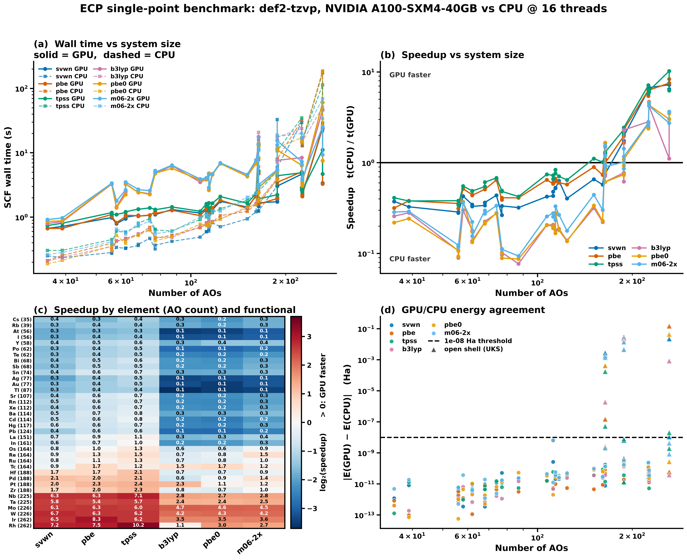

# ECP single-point benchmark: GPU4PySCF vs PySCF

One neutral compound per element carrying a def2-ECP (36 elements, 6 of them open shell), each run with 6 functionals on both devices.

> [!NOTE]
> Geometries are idealized VSEPR shapes with tabulated bond lengths, not optimized. Both devices see identical coordinates, so GPU/CPU comparisons are exact; the absolute energies are not thermochemical reference values.

> [!WARNING]
> The open-shell species keep the bond length tabulated for the corresponding anion in `systems.py`, and their multiplicities are formal d-count assignments, not verified ground states. An unrestricted SCF can also settle on different symmetry-broken solutions on the two devices; where that happens `dE` is large for reasons that have nothing to do with GPU accuracy. Check the **Open-shell / spin** section below before reading any `dE` on a UKS row.

## Settings

| key | value |
|---|---|
| systems | `neutral` |
| method | `auto` |
| basis | `def2-tzvp` |
| grid | `[75, 302]` |
| conv_tol | `1e-09` |
| max_cycle | `100` |
| cpu_threads | `16` |
| repeat | `1` |
| gpu | `NVIDIA A100-SXM4-40GB` |
| contract_engine | `cupy` |
| cupy | `13.6.0` |
| pyscf | `2.13.0` |
| gpu4pyscf | `1.8.1` |
| git_commit | `d62baa02e` |
| hostname | `nid001068` |
| slurm_job_id | `58474525` |
| timestamp | `2026-09-17T10:47:40-0700` |
| functionals | `svwn pbe tpss b3lyp pbe0 m06-2x` |
| SCF flavour | `180 RKS, 36 UKS` |

CPU references are built fresh from the Mole (`pyscf.dft.RKS` / `pyscf.dft.UKS`), never via `to_cpu()` of a converged GPU object -- that inherits the GPU density and biases CPU timings low by ~6x. The restricted/unrestricted choice depends only on the molecule and the `--method` flag, so both devices always run the same flavour.

## Failures

17 device-runs errored or hit the cycle cap. `cyc` at the cap means the SCF was still moving when it ran out; `contam` is `<S^2> - S(S+1)` against the requested spin, so a large value means the determinant drifted off the target state. The paired device is shown alongside for contrast.

| device | element | compound | 2S | functional | nao | converged | cyc | <S^2> | contam | other device | note |
|---|---|---|---:|---|---:|---|---:|---:|---:|---|---|
| **CPU** | Ir | IrCl6 | 3 | svwn | 262 | **NO** | 11 | 3.7550 | +0.0050 | ok, 12 cyc | hit cycle cap |
| **CPU** | Pd | PdCl4 | 2 | svwn | 188 | **NO** | 100 | 2.0017 | +0.0017 | also NO, 100 cyc | hit cycle cap |
| **CPU** | Re | ReO4 | 1 | svwn | 164 | **NO** | 100 | 0.7543 | +0.0043 | also NO, 100 cyc | hit cycle cap |
| **CPU** | Re | ReO4 | 1 | tpss | 164 | **NO** | 23 | 0.7619 | +0.0119 | ok, 22 cyc | hit cycle cap |
| **CPU** | Rh | RhCl6 | 3 | pbe | 262 | **NO** | 100 | 3.7558 | +0.0058 | also NO, 100 cyc | hit cycle cap |
| **CPU** | Rh | RhCl6 | 3 | svwn | 262 | **NO** | 100 | 3.7552 | +0.0052 | also NO, 100 cyc | hit cycle cap |
| **CPU** | Rh | RhCl6 | 3 | tpss | 262 | **NO** | 51 | 3.7572 | +0.0072 | ok, 32 cyc | hit cycle cap |
| **CPU** | Tc | TcO4 | 1 | b3lyp | 164 | **NO** | 100 | 0.8103 | +0.0603 | ok, 62 cyc | hit cycle cap |
| **CPU** | Tc | TcO4 | 1 | pbe | 164 | **NO** | 38 | 0.7598 | +0.0098 | ok, 32 cyc | hit cycle cap |
| **CPU** | Tc | TcO4 | 1 | svwn | 164 | **NO** | 100 | 0.7552 | +0.0052 | also NO, 100 cyc | hit cycle cap |
| **CPU** | Tc | TcO4 | 1 | tpss | 164 | **NO** | 48 | 0.7649 | +0.0149 | ok, 60 cyc | hit cycle cap |
| **GPU** | Pd | PdCl4 | 2 | svwn | 188 | **NO** | 100 | 2.0016 | +0.0016 | also NO, 100 cyc | hit cycle cap |
| **GPU** | Re | ReO4 | 1 | svwn | 164 | **NO** | 100 | 0.7543 | +0.0043 | also NO, 100 cyc | hit cycle cap |
| **GPU** | Rh | RhCl6 | 3 | pbe | 262 | **NO** | 100 | 3.7564 | +0.0064 | also NO, 100 cyc | hit cycle cap |
| **GPU** | Rh | RhCl6 | 3 | pbe0 | 262 | **NO** | 100 | 3.7612 | +0.0112 | ok, 90 cyc | hit cycle cap |
| **GPU** | Rh | RhCl6 | 3 | svwn | 262 | **NO** | 100 | 3.7555 | +0.0055 | also NO, 100 cyc | hit cycle cap |
| **GPU** | Tc | TcO4 | 1 | svwn | 164 | **NO** | 100 | 0.7553 | +0.0053 | also NO, 100 cyc | hit cycle cap |

## GPU vs CPU energy agreement

Worst |E_GPU - E_CPU| across functionals, per system. Threshold 1e-08 Ha.

| element | compound | chg | 2S | SCF | natm | nao | max abs dE (Ha) | worst functional | status |
|---|---|---:|---:|---|---:|---:|---:|---|---|
| Rb | RbH | +0 | 0 | RKS | 2 | 39 | 1.88e-11 | m06-2x | ok |
| Sr | SrCl2 | +0 | 0 | RKS | 3 | 107 | 4.46e-11 | m06-2x | ok |
| Y | YH3 | +0 | 0 | RKS | 4 | 58 | 3.69e-11 | m06-2x | ok |
| Zr | ZrCl4 | +0 | 0 | RKS | 5 | 188 | 1.72e-10 | m06-2x | ok |
| Nb | NbCl5 | +0 | 0 | RKS | 6 | 225 | 2.26e-10 | m06-2x | ok |
| Mo | MoF6 | +0 | 0 | RKS | 7 | 226 | 7.69e-11 | m06-2x | ok |
| Tc | TcO4 | +0 | 1 | UKS | 5 | 164 | 2.81e-03 | svwn | **dE > 1e-08**, 3 runs on a different SCF solution, 4 unconverged |
| Ru | RuO4 | +0 | 0 | RKS | 5 | 164 | 1.75e-10 | tpss | ok |
| Rh | RhCl6 | +0 | 3 | UKS | 7 | 262 | 1.48e-01 | pbe | **dE > 1e-08**, 4 runs on a different SCF solution, 4 unconverged |
| Pd | PdCl4 | +0 | 2 | UKS | 5 | 188 | 2.88e-02 | svwn | **dE > 1e-08**, 2 runs on a different SCF solution, 1 unconverged |
| Ag | AgCl | +0 | 0 | RKS | 2 | 77 | 1.80e-11 | m06-2x | ok |
| Cd | CdCl2 | +0 | 0 | RKS | 3 | 114 | 4.05e-11 | b3lyp | ok |
| In | InCl3 | +0 | 0 | RKS | 4 | 161 | 8.57e-11 | tpss | ok |
| Sn | SnH4 | +0 | 0 | RKS | 5 | 74 | 1.52e-11 | tpss | ok |
| Sb | SbH3 | +0 | 0 | RKS | 4 | 68 | 7.22e-12 | tpss | ok |
| Te | H2Te | +0 | 0 | RKS | 3 | 62 | 1.06e-11 | pbe0 | ok |
| I | HI | +0 | 0 | RKS | 2 | 56 | 5.80e-12 | tpss | ok |
| Xe | XeF2 | +0 | 0 | RKS | 3 | 112 | 6.36e-09 | m06-2x | ok |
| Cs | CsH | +0 | 0 | RKS | 2 | 35 | 4.81e-12 | m06-2x | ok |
| Ba | BaCl2 | +0 | 0 | RKS | 3 | 114 | 5.84e-11 | m06-2x | ok |
| La | LaCl3 | +0 | 0 | RKS | 4 | 151 | 9.80e-11 | m06-2x | ok |
| Hf | HfCl4 | +0 | 0 | RKS | 5 | 188 | 3.38e-10 | m06-2x | ok |
| Ta | TaCl5 | +0 | 0 | RKS | 6 | 225 | 2.40e-10 | m06-2x | ok |
| W | WF6 | +0 | 0 | RKS | 7 | 226 | 8.48e-11 | pbe | ok |
| Re | ReO4 | +0 | 1 | UKS | 5 | 164 | 1.81e-03 | svwn | **dE > 1e-08**, 2 runs on a different SCF solution, 2 unconverged |
| Os | OsO4 | +0 | 0 | RKS | 5 | 164 | 1.35e-10 | m06-2x | ok |
| Ir | IrCl6 | +0 | 3 | UKS | 7 | 262 | 1.09e-08 | svwn | **dE > 1e-08**, 1 unconverged |
| Pt | PtCl4 | +0 | 2 | UKS | 5 | 188 | 2.28e-02 | b3lyp | **dE > 1e-08**, 3 runs on a different SCF solution |
| Au | AuCl | +0 | 0 | RKS | 2 | 77 | 5.17e-11 | svwn | ok |
| Hg | HgCl2 | +0 | 0 | RKS | 3 | 117 | 3.43e-11 | tpss | ok |
| Tl | TlCl | +0 | 0 | RKS | 2 | 87 | 5.32e-11 | pbe0 | ok |
| Pb | PbCl2 | +0 | 0 | RKS | 3 | 124 | 5.00e-11 | m06-2x | ok |
| Bi | BiH3 | +0 | 0 | RKS | 4 | 68 | 1.96e-11 | m06-2x | ok |
| Po | H2Po | +0 | 0 | RKS | 3 | 62 | 4.43e-12 | tpss | ok |
| At | HAt | +0 | 0 | RKS | 2 | 56 | 6.03e-12 | m06-2x | ok |
| Rn | RnF2 | +0 | 0 | RKS | 3 | 112 | 2.64e-10 | svwn | ok |

## Open-shell / spin

Unrestricted runs only. `<S^2>` is the converged value on each device; `contam` is `<S^2> - S(S+1)` against the requested spin (large positive = the determinant is not the target spin state, expected for these formal high-oxidation-state species). `d<S^2>` above 1e-04 means the two devices converged to DIFFERENT solutions, and the corresponding `dE` is meaningless as an accuracy measure.

| element | compound | 2S | target S(S+1) | functional | <S^2> GPU | <S^2> CPU | d<S^2> | contam GPU | dE (Ha) | same solution? |
|---|---|---:|---:|---|---:|---:|---:|---:|---:|---|
| Ir | IrCl6 | 3 | 3.75 | b3lyp | 3.7622 | 3.7622 | 5.2e-09 | +0.0122 | 3.87e-11 | yes |
| Ir | IrCl6 | 3 | 3.75 | m06-2x | 3.7794 | 3.7794 | 2.9e-06 | +0.0294 | 8.60e-10 | yes |
| Ir | IrCl6 | 3 | 3.75 | pbe | 3.7561 | 3.7561 | 4.5e-07 | +0.0061 | 6.05e-11 | yes |
| Ir | IrCl6 | 3 | 3.75 | pbe0 | 3.7656 | 3.7656 | 1.2e-07 | +0.0156 | 2.75e-10 | yes |
| Ir | IrCl6 | 3 | 3.75 | svwn | 3.7550 | 3.7550 | 3.6e-08 | +0.0050 | 1.09e-08 | yes |
| Ir | IrCl6 | 3 | 3.75 | tpss | 3.7572 | 3.7572 | 8.6e-08 | +0.0072 | 1.95e-09 | yes |
| Pd | PdCl4 | 2 | 2.00 | b3lyp | 2.0072 | 2.0083 | 1.1e-03 | +0.0072 | 4.40e-03 | **no** |
| Pd | PdCl4 | 2 | 2.00 | m06-2x | 2.0167 | 2.0160 | 7.1e-04 | +0.0167 | 4.61e-03 | **no** |
| Pd | PdCl4 | 2 | 2.00 | pbe | 2.0032 | 2.0032 | 5.5e-08 | +0.0032 | 4.44e-10 | yes |
| Pd | PdCl4 | 2 | 2.00 | pbe0 | 2.0092 | 2.0092 | 1.1e-06 | +0.0092 | 1.87e-10 | yes |
| Pd | PdCl4 | 2 | 2.00 | svwn | 2.0016 | 2.0017 | 5.0e-05 | +0.0016 | 2.88e-02 | yes |
| Pd | PdCl4 | 2 | 2.00 | tpss | 2.0045 | 2.0045 | 2.2e-08 | +0.0045 | 7.71e-09 | yes |
| Pt | PtCl4 | 2 | 2.00 | b3lyp | 2.0078 | 2.0050 | 2.9e-03 | +0.0078 | 2.28e-02 | **no** |
| Pt | PtCl4 | 2 | 2.00 | m06-2x | 2.0099 | 2.0126 | 2.7e-03 | +0.0099 | 1.40e-02 | **no** |
| Pt | PtCl4 | 2 | 2.00 | pbe | 2.0031 | 2.0031 | 2.4e-09 | +0.0031 | 2.55e-10 | yes |
| Pt | PtCl4 | 2 | 2.00 | pbe0 | 2.0060 | 2.0088 | 2.8e-03 | +0.0060 | 1.51e-02 | **no** |
| Pt | PtCl4 | 2 | 2.00 | svwn | 2.0019 | 2.0019 | 4.3e-08 | +0.0019 | 6.45e-09 | yes |
| Pt | PtCl4 | 2 | 2.00 | tpss | 2.0044 | 2.0044 | 7.9e-08 | +0.0044 | 1.36e-11 | yes |
| Re | ReO4 | 1 | 0.75 | b3lyp | 0.7901 | 0.7974 | 7.3e-03 | +0.0401 | 4.36e-04 | **no** |
| Re | ReO4 | 1 | 0.75 | m06-2x | 0.8310 | 0.8303 | 7.1e-04 | +0.0810 | 1.40e-03 | **no** |
| Re | ReO4 | 1 | 0.75 | pbe | 0.7580 | 0.7580 | 2.9e-08 | +0.0080 | 2.56e-09 | yes |
| Re | ReO4 | 1 | 0.75 | pbe0 | 0.8051 | 0.8051 | 3.8e-06 | +0.0551 | 2.09e-09 | yes |
| Re | ReO4 | 1 | 0.75 | svwn | 0.7543 | 0.7543 | 1.3e-05 | +0.0043 | 1.81e-03 | yes |
| Re | ReO4 | 1 | 0.75 | tpss | 0.7619 | 0.7619 | 9.5e-07 | +0.0119 | 5.22e-08 | yes |
| Rh | RhCl6 | 3 | 3.75 | b3lyp | 3.7625 | 3.7619 | 6.1e-04 | +0.0125 | 8.47e-04 | **no** |
| Rh | RhCl6 | 3 | 3.75 | m06-2x | 3.7716 | 3.7716 | 1.1e-06 | +0.0216 | 4.31e-09 | yes |
| Rh | RhCl6 | 3 | 3.75 | pbe | 3.7564 | 3.7558 | 6.1e-04 | +0.0064 | 1.48e-01 | **no** |
| Rh | RhCl6 | 3 | 3.75 | pbe0 | 3.7612 | 3.7659 | 4.7e-03 | +0.0112 | 4.30e-02 | **no** |
| Rh | RhCl6 | 3 | 3.75 | svwn | 3.7555 | 3.7552 | 3.6e-04 | +0.0055 | 2.21e-02 | **no** |
| Rh | RhCl6 | 3 | 3.75 | tpss | 3.7572 | 3.7572 | 2.8e-08 | +0.0072 | 2.04e-08 | yes |
| Tc | TcO4 | 1 | 0.75 | b3lyp | 0.8102 | 0.8103 | 1.3e-04 | +0.0602 | 1.90e-06 | **no** |
| Tc | TcO4 | 1 | 0.75 | m06-2x | 0.8781 | 0.8781 | 1.9e-06 | +0.1281 | 2.11e-09 | yes |
| Tc | TcO4 | 1 | 0.75 | pbe | 0.7598 | 0.7598 | 3.5e-08 | +0.0098 | 1.49e-07 | yes |
| Tc | TcO4 | 1 | 0.75 | pbe0 | 0.8336 | 0.8469 | 1.3e-02 | +0.0836 | 4.14e-04 | **no** |
| Tc | TcO4 | 1 | 0.75 | svwn | 0.7553 | 0.7552 | 2.7e-05 | +0.0053 | 2.81e-03 | yes |
| Tc | TcO4 | 1 | 0.75 | tpss | 0.7738 | 0.7649 | 8.8e-03 | +0.0238 | 1.74e-04 | **no** |

22/36 unrestricted pairs reached the same solution on both devices.

> [!IMPORTANT]
> Rows marked **no** are a UKS initial-guess / convergence difference, not a GPU integral or XC error. To compare those systems numerically, restart both devices from the same converged density, or exclude them from the dE statistics.

## Speedup (CPU wall time / GPU wall time)

CPU at 16 threads, single GPU. Values below 1.00 mean the CPU was faster.

| element | compound | nao | svwn | pbe | tpss | b3lyp | pbe0 | m06-2x | mean |
|---|---|---:|---:|---:|---:|---:|---:|---:|---:|
| Rb | RbH | 39 | 0.33 | 0.38 | 0.38 | 0.28 | 0.24 | 0.29 | 0.32 |
| Sr | SrCl2 | 107 | 0.42 | 0.65 | 0.74 | 0.21 | 0.21 | 0.26 | 0.41 |
| Y | YH3 | 58 | 0.43 | 0.52 | 0.55 | 0.30 | 0.37 | 0.36 | 0.42 |
| Zr | ZrCl4 | 188 | 1.75 | 1.97 | 2.32 | 0.78 | 0.74 | 1.01 | 1.43 |
| Nb | NbCl5 | 225 | 6.33 | 6.32 | 7.13 | 2.82 | 2.68 | 2.75 | 4.67 |
| Mo | MoF6 | 226 | 6.06 | 6.25 | 6.00 | 4.70 | 4.63 | 4.55 | 5.36 |
| Tc | TcO4 | 164 | 0.90 | 1.65 | 1.24 | 1.48 | 1.66 | 1.19 | 1.35 |
| Ru | RuO4 | 164 | 0.84 | 1.10 | 1.30 | 0.75 | 0.80 | 0.96 | 0.96 |
| Rh | RhCl6 | 262 | 7.23 | 7.55 | 10.23 | 1.11 | 3.02 | 2.73 | 5.31 |
| Pd | PdCl4 | 188 | 2.12 | 1.99 | 2.12 | 0.62 | 0.93 | 1.43 | 1.53 |
| Ag | AgCl | 77 | 0.26 | 0.39 | 0.49 | 0.10 | 0.10 | 0.11 | 0.24 |
| Cd | CdCl2 | 114 | 0.53 | 0.62 | 0.84 | 0.18 | 0.17 | 0.23 | 0.43 |
| In | InCl3 | 161 | 0.57 | 0.73 | 1.01 | 0.22 | 0.23 | 0.30 | 0.51 |
| Sn | SnH4 | 74 | 0.44 | 0.65 | 0.68 | 0.28 | 0.28 | 0.34 | 0.44 |
| Sb | SbH3 | 68 | 0.34 | 0.51 | 0.55 | 0.22 | 0.22 | 0.30 | 0.36 |
| Te | H2Te | 62 | 0.35 | 0.44 | 0.49 | 0.18 | 0.17 | 0.22 | 0.31 |
| I | HI | 56 | 0.29 | 0.36 | 0.38 | 0.11 | 0.11 | 0.12 | 0.23 |
| Xe | XeF2 | 112 | 0.43 | 0.59 | 0.73 | 0.21 | 0.20 | 0.28 | 0.40 |
| Cs | CsH | 35 | 0.37 | 0.32 | 0.41 | 0.26 | 0.22 | 0.29 | 0.31 |
| Ba | BaCl2 | 114 | 0.52 | 0.67 | 0.76 | 0.27 | 0.28 | 0.33 | 0.47 |
| La | LaCl3 | 151 | 0.66 | 0.90 | 1.11 | 0.32 | 0.34 | 0.44 | 0.63 |
| Hf | HfCl4 | 188 | 1.67 | 1.66 | 2.06 | 0.74 | 0.73 | 0.86 | 1.29 |
| Ta | TaCl5 | 225 | 5.83 | 5.43 | 5.74 | 2.44 | 2.39 | 2.54 | 4.06 |
| W | WF6 | 226 | 6.72 | 6.30 | 6.21 | 4.22 | 4.32 | 4.24 | 5.34 |
| Re | ReO4 | 164 | 0.88 | 1.26 | 1.55 | 0.72 | 0.84 | 1.55 | 1.13 |
| Os | OsO4 | 164 | 0.75 | 0.99 | 1.30 | 0.61 | 0.61 | 0.91 | 0.86 |
| Ir | IrCl6 | 262 | 6.47 | 8.35 | 6.24 | 3.50 | 3.49 | 3.65 | 5.28 |
| Pt | PtCl4 | 188 | 1.97 | 2.30 | 2.44 | 2.30 | 1.09 | 1.17 | 1.88 |
| Au | AuCl | 77 | 0.33 | 0.41 | 0.48 | 0.10 | 0.09 | 0.11 | 0.26 |
| Hg | HgCl2 | 117 | 0.63 | 0.60 | 0.71 | 0.19 | 0.18 | 0.27 | 0.43 |
| Tl | TlCl | 87 | 0.32 | 0.41 | 0.42 | 0.08 | 0.09 | 0.09 | 0.24 |
| Pb | PbCl2 | 124 | 0.40 | 0.58 | 0.65 | 0.14 | 0.14 | 0.18 | 0.35 |
| Bi | BiH3 | 68 | 0.36 | 0.51 | 0.61 | 0.23 | 0.21 | 0.27 | 0.37 |
| Po | H2Po | 62 | 0.33 | 0.44 | 0.49 | 0.14 | 0.13 | 0.15 | 0.28 |
| At | HAt | 56 | 0.28 | 0.31 | 0.34 | 0.09 | 0.09 | 0.12 | 0.21 |
| Rn | RnF2 | 112 | 0.48 | 0.61 | 0.66 | 0.19 | 0.19 | 0.25 | 0.40 |

## Per-functional summary

| functional | systems | mean speedup | median speedup | total GPU (s) | total CPU (s) | max abs dE (Ha) |
|---|---:|---:|---:|---:|---:|---:|
| svwn | 36 | 1.63 | 0.53 | 116.7 | 351.0 | 2.88e-02 |
| pbe | 36 | 1.80 | 0.65 | 90.6 | 342.9 | 1.48e-01 |
| tpss | 36 | 1.93 | 0.75 | 95.3 | 306.0 | 1.74e-04 |
| b3lyp | 36 | 0.86 | 0.27 | 222.1 | 230.9 | 2.28e-02 |
| pbe0 | 36 | 0.89 | 0.26 | 225.5 | 343.3 | 4.30e-02 |
| m06-2x | 36 | 0.97 | 0.32 | 209.1 | 277.3 | 1.40e-02 |

## Full results

Every per-device column is `GPU/CPU`. `conv` is the SCF convergence flag, `cyc` the cycle count and `<S^2>` the converged spin expectation -- the three numbers to read together when a run looks wrong. A **NO** in `conv` means that device hit the cycle cap, so its energy and any `dE` built from it are not converged values.

| element | compound | 2S | SCF | nao | functional | E_GPU (Ha) | E_CPU (Ha) | dE (Ha) | t_GPU (s) | t_CPU (s) | speedup | conv | cyc | <S^2> |
|---|---|---:|---|---:|---|---:|---:|---:|---:|---:|---:|---|---:|---:|
| Cs | CsH | 0 | RKS | 35 | b3lyp | -20.71844334 | -20.71844334 | 3.91e-13 | 0.80 | 0.21 | 0.26 | yes/yes | 9/9 | --/-- |
| Cs | CsH | 0 | RKS | 35 | m06-2x | -20.63704300 | -20.63704300 | 4.81e-12 | 0.92 | 0.26 | 0.29 | yes/yes | 9/9 | --/-- |
| Cs | CsH | 0 | RKS | 35 | pbe | -20.71089600 | -20.71089600 | 8.46e-13 | 0.67 | 0.21 | 0.32 | yes/yes | 10/10 | --/-- |
| Cs | CsH | 0 | RKS | 35 | pbe0 | -20.70282192 | -20.70282192 | 4.12e-13 | 0.86 | 0.19 | 0.22 | yes/yes | 9/9 | --/-- |
| Cs | CsH | 0 | RKS | 35 | svwn | -20.62355049 | -20.62355049 | 1.19e-12 | 0.67 | 0.25 | 0.37 | yes/yes | 10/10 | --/-- |
| Cs | CsH | 0 | RKS | 35 | tpss | -20.71867508 | -20.71867508 | 1.28e-13 | 0.74 | 0.30 | 0.41 | yes/yes | 10/10 | --/-- |
| Rb | RbH | 0 | RKS | 39 | b3lyp | -24.66370976 | -24.66370976 | 1.88e-13 | 0.85 | 0.24 | 0.28 | yes/yes | 9/9 | --/-- |
| Rb | RbH | 0 | RKS | 39 | m06-2x | -24.58263955 | -24.58263955 | 1.88e-11 | 0.97 | 0.28 | 0.29 | yes/yes | 8/8 | --/-- |
| Rb | RbH | 0 | RKS | 39 | pbe | -24.64158157 | -24.64158157 | 9.59e-14 | 0.67 | 0.25 | 0.38 | yes/yes | 10/10 | --/-- |
| Rb | RbH | 0 | RKS | 39 | pbe0 | -24.64001621 | -24.64001621 | 7.11e-14 | 0.88 | 0.21 | 0.24 | yes/yes | 9/9 | --/-- |
| Rb | RbH | 0 | RKS | 39 | svwn | -24.53719334 | -24.53719334 | 8.27e-12 | 0.72 | 0.23 | 0.33 | yes/yes | 10/10 | --/-- |
| Rb | RbH | 0 | RKS | 39 | tpss | -24.65040319 | -24.65040319 | 1.31e-11 | 0.80 | 0.30 | 0.38 | yes/yes | 10/10 | --/-- |
| At | HAt | 0 | RKS | 56 | b3lyp | -263.17682658 | -263.17682658 | 7.39e-13 | 3.31 | 0.30 | 0.09 | yes/yes | 9/9 | --/-- |
| At | HAt | 0 | RKS | 56 | m06-2x | -262.95475729 | -262.95475729 | 6.03e-12 | 3.36 | 0.40 | 0.12 | yes/yes | 9/9 | --/-- |
| At | HAt | 0 | RKS | 56 | pbe | -263.10435784 | -263.10435784 | 3.30e-12 | 1.02 | 0.32 | 0.31 | yes/yes | 10/10 | --/-- |
| At | HAt | 0 | RKS | 56 | pbe0 | -263.09184626 | -263.09184626 | 5.68e-14 | 3.25 | 0.30 | 0.09 | yes/yes | 9/9 | --/-- |
| At | HAt | 0 | RKS | 56 | svwn | -262.76732377 | -262.76732377 | 4.09e-12 | 0.98 | 0.27 | 0.28 | yes/yes | 10/10 | --/-- |
| At | HAt | 0 | RKS | 56 | tpss | -263.00686957 | -263.00686957 | 5.12e-12 | 1.10 | 0.38 | 0.34 | yes/yes | 9/9 | --/-- |
| I | HI | 0 | RKS | 56 | b3lyp | -298.40519492 | -298.40519492 | 1.25e-12 | 3.26 | 0.35 | 0.11 | yes/yes | 9/9 | --/-- |
| I | HI | 0 | RKS | 56 | m06-2x | -298.22395420 | -298.22395420 | 5.12e-13 | 3.35 | 0.41 | 0.12 | yes/yes | 9/9 | --/-- |
| I | HI | 0 | RKS | 56 | pbe | -298.29082462 | -298.29082462 | 1.71e-12 | 1.10 | 0.39 | 0.36 | yes/yes | 10/10 | --/-- |
| I | HI | 0 | RKS | 56 | pbe0 | -298.31759924 | -298.31759924 | 1.02e-12 | 3.29 | 0.36 | 0.11 | yes/yes | 9/9 | --/-- |
| I | HI | 0 | RKS | 56 | svwn | -297.88259316 | -297.88259316 | 2.05e-12 | 0.99 | 0.28 | 0.29 | yes/yes | 10/10 | --/-- |
| I | HI | 0 | RKS | 56 | tpss | -298.19695431 | -298.19695431 | 5.80e-12 | 1.17 | 0.45 | 0.38 | yes/yes | 10/10 | --/-- |
| Y | YH3 | 0 | RKS | 58 | b3lyp | -40.06567018 | -40.06567018 | 6.52e-12 | 1.44 | 0.43 | 0.30 | yes/yes | 8/8 | --/-- |
| Y | YH3 | 0 | RKS | 58 | m06-2x | -39.94378634 | -39.94378634 | 3.69e-11 | 1.79 | 0.65 | 0.36 | yes/yes | 9/9 | --/-- |
| Y | YH3 | 0 | RKS | 58 | pbe | -40.02950655 | -40.02950655 | 1.23e-12 | 0.82 | 0.42 | 0.52 | yes/yes | 9/9 | --/-- |
| Y | YH3 | 0 | RKS | 58 | pbe0 | -40.02205093 | -40.02205093 | 4.47e-12 | 1.40 | 0.52 | 0.37 | yes/yes | 8/8 | --/-- |
| Y | YH3 | 0 | RKS | 58 | svwn | -39.87435353 | -39.87435353 | 3.48e-13 | 0.79 | 0.34 | 0.43 | yes/yes | 9/9 | --/-- |
| Y | YH3 | 0 | RKS | 58 | tpss | -40.04905092 | -40.04905092 | 9.59e-13 | 1.10 | 0.61 | 0.55 | yes/yes | 9/9 | --/-- |
| Po | H2Po | 0 | RKS | 62 | b3lyp | -239.08496642 | -239.08496642 | 2.39e-12 | 3.29 | 0.45 | 0.14 | yes/yes | 9/9 | --/-- |
| Po | H2Po | 0 | RKS | 62 | m06-2x | -238.85256073 | -238.85256073 | 4.12e-12 | 3.51 | 0.54 | 0.15 | yes/yes | 9/9 | --/-- |
| Po | H2Po | 0 | RKS | 62 | pbe | -239.01832219 | -239.01832219 | 1.14e-13 | 1.07 | 0.47 | 0.44 | yes/yes | 10/10 | --/-- |
| Po | H2Po | 0 | RKS | 62 | pbe0 | -238.99984675 | -238.99984675 | 2.13e-12 | 3.26 | 0.43 | 0.13 | yes/yes | 9/9 | --/-- |
| Po | H2Po | 0 | RKS | 62 | svwn | -238.68757506 | -238.68757506 | 3.55e-12 | 1.00 | 0.33 | 0.33 | yes/yes | 10/10 | --/-- |
| Po | H2Po | 0 | RKS | 62 | tpss | -238.93077285 | -238.93077285 | 4.43e-12 | 1.21 | 0.59 | 0.49 | yes/yes | 9/9 | --/-- |
| Te | H2Te | 0 | RKS | 62 | b3lyp | -269.30509704 | -269.30509704 | 6.82e-13 | 2.50 | 0.45 | 0.18 | yes/yes | 9/9 | --/-- |
| Te | H2Te | 0 | RKS | 62 | m06-2x | -269.11875609 | -269.11875609 | 3.47e-12 | 2.64 | 0.59 | 0.22 | yes/yes | 9/9 | --/-- |
| Te | H2Te | 0 | RKS | 62 | pbe | -269.19769771 | -269.19769771 | 3.52e-12 | 1.02 | 0.45 | 0.44 | yes/yes | 10/10 | --/-- |
| Te | H2Te | 0 | RKS | 62 | pbe0 | -269.21787834 | -269.21787834 | 1.06e-11 | 2.25 | 0.39 | 0.17 | yes/yes | 8/8 | --/-- |
| Te | H2Te | 0 | RKS | 62 | svwn | -268.80442159 | -268.80442159 | 9.38e-12 | 0.95 | 0.33 | 0.35 | yes/yes | 10/10 | --/-- |
| Te | H2Te | 0 | RKS | 62 | tpss | -269.11291010 | -269.11291010 | 5.00e-12 | 1.19 | 0.58 | 0.49 | yes/yes | 9/9 | --/-- |
| Bi | BiH3 | 0 | RKS | 68 | b3lyp | -216.48501299 | -216.48501299 | 1.51e-12 | 2.46 | 0.55 | 0.23 | yes/yes | 9/9 | --/-- |
| Bi | BiH3 | 0 | RKS | 68 | m06-2x | -216.25093398 | -216.25093398 | 1.96e-11 | 2.67 | 0.73 | 0.27 | yes/yes | 9/9 | --/-- |
| Bi | BiH3 | 0 | RKS | 68 | pbe | -216.42272010 | -216.42272010 | 8.78e-12 | 1.04 | 0.53 | 0.51 | yes/yes | 9/9 | --/-- |
| Bi | BiH3 | 0 | RKS | 68 | pbe0 | -216.39949882 | -216.39949882 | 1.88e-12 | 2.45 | 0.52 | 0.21 | yes/yes | 9/9 | --/-- |
| Bi | BiH3 | 0 | RKS | 68 | svwn | -216.09720185 | -216.09720185 | 9.83e-12 | 1.03 | 0.38 | 0.36 | yes/yes | 10/10 | --/-- |
| Bi | BiH3 | 0 | RKS | 68 | tpss | -216.34652488 | -216.34652488 | 4.46e-12 | 1.33 | 0.81 | 0.61 | yes/yes | 9/9 | --/-- |
| Sb | SbH3 | 0 | RKS | 68 | b3lyp | -242.11805954 | -242.11805954 | 6.82e-13 | 2.43 | 0.54 | 0.22 | yes/yes | 9/9 | --/-- |
| Sb | SbH3 | 0 | RKS | 68 | m06-2x | -241.92964471 | -241.92964471 | 1.19e-12 | 2.71 | 0.81 | 0.30 | yes/yes | 9/9 | --/-- |
| Sb | SbH3 | 0 | RKS | 68 | pbe | -242.01507646 | -242.01507646 | 4.38e-12 | 1.05 | 0.54 | 0.51 | yes/yes | 9/9 | --/-- |
| Sb | SbH3 | 0 | RKS | 68 | pbe0 | -242.02985239 | -242.02985239 | 5.12e-13 | 2.42 | 0.53 | 0.22 | yes/yes | 9/9 | --/-- |
| Sb | SbH3 | 0 | RKS | 68 | svwn | -241.63232806 | -241.63232806 | 3.41e-13 | 1.07 | 0.36 | 0.34 | yes/yes | 10/10 | --/-- |
| Sb | SbH3 | 0 | RKS | 68 | tpss | -241.94200084 | -241.94200084 | 7.22e-12 | 1.34 | 0.73 | 0.55 | yes/yes | 9/9 | --/-- |
| Sn | SnH4 | 0 | RKS | 74 | b3lyp | -216.74751596 | -216.74751596 | 1.65e-12 | 2.30 | 0.64 | 0.28 | yes/yes | 8/8 | --/-- |
| Sn | SnH4 | 0 | RKS | 74 | m06-2x | -216.58042752 | -216.58042752 | 2.50e-12 | 2.58 | 0.87 | 0.34 | yes/yes | 8/8 | --/-- |
| Sn | SnH4 | 0 | RKS | 74 | pbe | -216.64791735 | -216.64791735 | 4.43e-12 | 1.08 | 0.70 | 0.65 | yes/yes | 9/9 | --/-- |
| Sn | SnH4 | 0 | RKS | 74 | pbe0 | -216.66468409 | -216.66468409 | 6.76e-12 | 2.26 | 0.63 | 0.28 | yes/yes | 8/8 | --/-- |
| Sn | SnH4 | 0 | RKS | 74 | svwn | -216.28396953 | -216.28396953 | 1.22e-11 | 1.07 | 0.47 | 0.44 | yes/yes | 9/9 | --/-- |
| Sn | SnH4 | 0 | RKS | 74 | tpss | -216.58724599 | -216.58724599 | 1.52e-11 | 1.39 | 0.95 | 0.68 | yes/yes | 9/9 | --/-- |
| Ag | AgCl | 0 | RKS | 77 | b3lyp | -607.30263090 | -607.30263090 | 1.14e-12 | 4.86 | 0.47 | 0.10 | yes/yes | 12/12 | --/-- |
| Ag | AgCl | 0 | RKS | 77 | m06-2x | -607.14737880 | -607.14737880 | 1.80e-11 | 5.27 | 0.59 | 0.11 | yes/yes | 13/13 | --/-- |
| Ag | AgCl | 0 | RKS | 77 | pbe | -607.05748082 | -607.05748082 | 1.59e-11 | 1.21 | 0.47 | 0.39 | yes/yes | 13/13 | --/-- |
| Ag | AgCl | 0 | RKS | 77 | pbe0 | -607.07669927 | -607.07669927 | 1.39e-11 | 4.76 | 0.49 | 0.10 | yes/yes | 12/12 | --/-- |
| Ag | AgCl | 0 | RKS | 77 | svwn | -605.49632718 | -605.49632718 | 1.30e-11 | 1.21 | 0.32 | 0.26 | yes/yes | 13/13 | --/-- |
| Ag | AgCl | 0 | RKS | 77 | tpss | -607.19688500 | -607.19688500 | 1.14e-11 | 1.32 | 0.65 | 0.49 | yes/yes | 12/12 | --/-- |
| Au | AuCl | 0 | RKS | 77 | b3lyp | -596.02434415 | -596.02434415 | 1.44e-11 | 4.76 | 0.49 | 0.10 | yes/yes | 12/12 | --/-- |
| Au | AuCl | 0 | RKS | 77 | m06-2x | -595.83431788 | -595.83431788 | 1.72e-11 | 5.00 | 0.56 | 0.11 | yes/yes | 12/12 | --/-- |
| Au | AuCl | 0 | RKS | 77 | pbe | -595.81423333 | -595.81423333 | 1.35e-11 | 1.14 | 0.47 | 0.41 | yes/yes | 11/11 | --/-- |
| Au | AuCl | 0 | RKS | 77 | pbe0 | -595.80317293 | -595.80317293 | 1.31e-11 | 4.81 | 0.43 | 0.09 | yes/yes | 12/12 | --/-- |
| Au | AuCl | 0 | RKS | 77 | svwn | -594.28722828 | -594.28722828 | 5.17e-11 | 1.10 | 0.37 | 0.33 | yes/yes | 11/12 | --/-- |
| Au | AuCl | 0 | RKS | 77 | tpss | -595.95093650 | -595.95093650 | 6.14e-12 | 1.30 | 0.63 | 0.48 | yes/yes | 11/11 | --/-- |
| Tl | TlCl | 0 | RKS | 87 | b3lyp | -632.89178401 | -632.89178401 | 1.50e-11 | 6.29 | 0.48 | 0.08 | yes/yes | 10/10 | --/-- |
| Tl | TlCl | 0 | RKS | 87 | m06-2x | -632.67669192 | -632.67669192 | 2.43e-11 | 6.41 | 0.60 | 0.09 | yes/yes | 10/10 | --/-- |
| Tl | TlCl | 0 | RKS | 87 | pbe | -632.66002257 | -632.66002257 | 3.18e-12 | 1.28 | 0.52 | 0.41 | yes/yes | 10/10 | --/-- |
| Tl | TlCl | 0 | RKS | 87 | pbe0 | -632.65748572 | -632.65748572 | 5.32e-11 | 5.73 | 0.50 | 0.09 | yes/yes | 9/10 | --/-- |
| Tl | TlCl | 0 | RKS | 87 | svwn | -631.09488790 | -631.09488790 | 2.07e-11 | 1.31 | 0.42 | 0.32 | yes/yes | 11/11 | --/-- |
| Tl | TlCl | 0 | RKS | 87 | tpss | -632.78586447 | -632.78586447 | 5.46e-12 | 1.44 | 0.61 | 0.42 | yes/yes | 10/10 | --/-- |
| Sr | SrCl2 | 0 | RKS | 107 | b3lyp | -951.35817065 | -951.35817065 | 3.52e-11 | 3.50 | 0.72 | 0.21 | yes/yes | 8/8 | --/-- |
| Sr | SrCl2 | 0 | RKS | 107 | m06-2x | -951.21714990 | -951.21714990 | 4.46e-11 | 3.91 | 1.00 | 0.26 | yes/yes | 9/9 | --/-- |
| Sr | SrCl2 | 0 | RKS | 107 | pbe | -950.93355058 | -950.93355058 | 1.61e-11 | 1.06 | 0.68 | 0.65 | yes/yes | 8/8 | --/-- |
| Sr | SrCl2 | 0 | RKS | 107 | pbe0 | -951.00445719 | -951.00445719 | 3.46e-11 | 3.77 | 0.78 | 0.21 | yes/yes | 9/9 | --/-- |
| Sr | SrCl2 | 0 | RKS | 107 | svwn | -948.23937055 | -948.23937055 | 3.64e-11 | 1.16 | 0.49 | 0.42 | yes/yes | 9/9 | --/-- |
| Sr | SrCl2 | 0 | RKS | 107 | tpss | -951.35440082 | -951.35440082 | 1.59e-11 | 1.23 | 0.92 | 0.74 | yes/yes | 8/8 | --/-- |
| Rn | RnF2 | 0 | RKS | 112 | b3lyp | -488.44987268 | -488.44987268 | 4.77e-12 | 3.89 | 0.76 | 0.19 | yes/yes | 9/9 | --/-- |
| Rn | RnF2 | 0 | RKS | 112 | m06-2x | -488.15196468 | -488.15196468 | 1.25e-11 | 4.05 | 1.03 | 0.25 | yes/yes | 9/9 | --/-- |
| Rn | RnF2 | 0 | RKS | 112 | pbe | -488.20124515 | -488.20124515 | 5.46e-12 | 1.35 | 0.82 | 0.61 | yes/yes | 10/10 | --/-- |
| Rn | RnF2 | 0 | RKS | 112 | pbe0 | -488.17304905 | -488.17304905 | 2.05e-12 | 3.87 | 0.74 | 0.19 | yes/yes | 9/9 | --/-- |
| Rn | RnF2 | 0 | RKS | 112 | svwn | -486.78732194 | -486.78732194 | 2.64e-10 | 1.23 | 0.59 | 0.48 | yes/yes | 9/9 | --/-- |
| Rn | RnF2 | 0 | RKS | 112 | tpss | -488.28905163 | -488.28905163 | 5.89e-11 | 1.53 | 1.01 | 0.66 | yes/yes | 9/9 | --/-- |
| Xe | XeF2 | 0 | RKS | 112 | b3lyp | -529.10423523 | -529.10423524 | 6.29e-09 | 3.84 | 0.80 | 0.21 | yes/yes | 9/9 | --/-- |
| Xe | XeF2 | 0 | RKS | 112 | m06-2x | -528.84285219 | -528.84285219 | 6.36e-09 | 4.08 | 1.13 | 0.28 | yes/yes | 9/9 | --/-- |
| Xe | XeF2 | 0 | RKS | 112 | pbe | -528.81348708 | -528.81348709 | 6.14e-09 | 1.33 | 0.78 | 0.59 | yes/yes | 9/9 | --/-- |
| Xe | XeF2 | 0 | RKS | 112 | pbe0 | -528.82500474 | -528.82500475 | 6.31e-09 | 3.84 | 0.77 | 0.20 | yes/yes | 9/9 | --/-- |
| Xe | XeF2 | 0 | RKS | 112 | svwn | -527.32104471 | -527.32104471 | 6.21e-09 | 1.39 | 0.60 | 0.43 | yes/yes | 10/10 | --/-- |
| Xe | XeF2 | 0 | RKS | 112 | tpss | -528.90483884 | -528.90483885 | 6.30e-09 | 1.62 | 1.17 | 0.73 | yes/yes | 10/10 | --/-- |
| Ba | BaCl2 | 0 | RKS | 114 | b3lyp | -946.13391868 | -946.13391868 | 4.41e-11 | 2.68 | 0.72 | 0.27 | yes/yes | 8/8 | --/-- |
| Ba | BaCl2 | 0 | RKS | 114 | m06-2x | -945.99227935 | -945.99227935 | 5.84e-11 | 2.87 | 0.95 | 0.33 | yes/yes | 8/8 | --/-- |
| Ba | BaCl2 | 0 | RKS | 114 | pbe | -945.73046108 | -945.73046108 | 2.89e-11 | 1.09 | 0.73 | 0.67 | yes/yes | 8/8 | --/-- |
| Ba | BaCl2 | 0 | RKS | 114 | pbe0 | -945.78728164 | -945.78728164 | 3.82e-11 | 2.63 | 0.74 | 0.28 | yes/yes | 8/8 | --/-- |
| Ba | BaCl2 | 0 | RKS | 114 | svwn | -943.05067368 | -943.05067368 | 2.11e-11 | 1.16 | 0.61 | 0.52 | yes/yes | 9/9 | --/-- |
| Ba | BaCl2 | 0 | RKS | 114 | tpss | -946.14943850 | -946.14943850 | 3.46e-11 | 1.28 | 0.97 | 0.76 | yes/yes | 8/8 | --/-- |
| Cd | CdCl2 | 0 | RKS | 114 | b3lyp | -1088.37470025 | -1088.37470025 | 4.05e-11 | 4.77 | 0.86 | 0.18 | yes/yes | 11/11 | --/-- |
| Cd | CdCl2 | 0 | RKS | 114 | m06-2x | -1088.18786610 | -1088.18786610 | 3.64e-11 | 4.59 | 1.07 | 0.23 | yes/yes | 10/10 | --/-- |
| Cd | CdCl2 | 0 | RKS | 114 | pbe | -1087.91614253 | -1087.91614253 | 1.00e-11 | 1.38 | 0.86 | 0.62 | yes/yes | 12/12 | --/-- |
| Cd | CdCl2 | 0 | RKS | 114 | pbe0 | -1087.98174801 | -1087.98174801 | 2.77e-11 | 4.80 | 0.80 | 0.17 | yes/yes | 11/11 | --/-- |
| Cd | CdCl2 | 0 | RKS | 114 | svwn | -1085.04305834 | -1085.04305834 | 2.14e-11 | 1.25 | 0.66 | 0.53 | yes/yes | 11/11 | --/-- |
| Cd | CdCl2 | 0 | RKS | 114 | tpss | -1088.25935451 | -1088.25935451 | 3.41e-11 | 1.66 | 1.39 | 0.84 | yes/yes | 12/12 | --/-- |
| Hg | HgCl2 | 0 | RKS | 117 | b3lyp | -1074.06755214 | -1074.06755214 | 2.91e-11 | 4.60 | 0.86 | 0.19 | yes/yes | 10/10 | --/-- |
| Hg | HgCl2 | 0 | RKS | 117 | m06-2x | -1073.84031352 | -1073.84031352 | 2.55e-11 | 4.71 | 1.26 | 0.27 | yes/yes | 10/10 | --/-- |
| Hg | HgCl2 | 0 | RKS | 117 | pbe | -1073.64640242 | -1073.64640242 | 2.46e-11 | 1.39 | 0.84 | 0.60 | yes/yes | 11/11 | --/-- |
| Hg | HgCl2 | 0 | RKS | 117 | pbe0 | -1073.68113092 | -1073.68113092 | 2.73e-11 | 4.58 | 0.83 | 0.18 | yes/yes | 10/10 | --/-- |
| Hg | HgCl2 | 0 | RKS | 117 | svwn | -1070.81850281 | -1070.81850281 | 2.07e-11 | 1.30 | 0.82 | 0.63 | yes/yes | 11/11 | --/-- |
| Hg | HgCl2 | 0 | RKS | 117 | tpss | -1073.98655304 | -1073.98655304 | 3.43e-11 | 1.65 | 1.17 | 0.71 | yes/yes | 11/11 | --/-- |
| Pb | PbCl2 | 0 | RKS | 124 | b3lyp | -1113.51786603 | -1113.51786603 | 2.46e-11 | 6.79 | 0.94 | 0.14 | yes/yes | 10/10 | --/-- |
| Pb | PbCl2 | 0 | RKS | 124 | m06-2x | -1113.26213759 | -1113.26213759 | 5.00e-11 | 6.97 | 1.24 | 0.18 | yes/yes | 10/10 | --/-- |
| Pb | PbCl2 | 0 | RKS | 124 | pbe | -1113.07804327 | -1113.07804327 | 5.46e-12 | 1.83 | 1.06 | 0.58 | yes/yes | 12/12 | --/-- |
| Pb | PbCl2 | 0 | RKS | 124 | pbe0 | -1113.11587461 | -1113.11587461 | 4.18e-11 | 6.80 | 0.93 | 0.14 | yes/yes | 10/10 | --/-- |
| Pb | PbCl2 | 0 | RKS | 124 | svwn | -1110.20771363 | -1110.20771363 | 4.05e-11 | 1.76 | 0.71 | 0.40 | yes/yes | 12/12 | --/-- |
| Pb | PbCl2 | 0 | RKS | 124 | tpss | -1113.40728091 | -1113.40728091 | 3.37e-11 | 2.09 | 1.35 | 0.65 | yes/yes | 12/12 | --/-- |
| La | LaCl3 | 0 | RKS | 151 | b3lyp | -1412.54547833 | -1412.54547833 | 3.55e-11 | 4.35 | 1.38 | 0.32 | yes/yes | 9/9 | --/-- |
| La | LaCl3 | 0 | RKS | 151 | m06-2x | -1412.36168155 | -1412.36168155 | 9.80e-11 | 4.60 | 2.04 | 0.44 | yes/yes | 9/9 | --/-- |
| La | LaCl3 | 0 | RKS | 151 | pbe | -1411.94005537 | -1411.94005537 | 4.55e-12 | 1.37 | 1.23 | 0.90 | yes/yes | 8/8 | --/-- |
| La | LaCl3 | 0 | RKS | 151 | pbe0 | -1412.03237721 | -1412.03237721 | 8.25e-11 | 4.30 | 1.45 | 0.34 | yes/yes | 9/9 | --/-- |
| La | LaCl3 | 0 | RKS | 151 | svwn | -1407.97321174 | -1407.97321174 | 3.98e-11 | 1.43 | 0.94 | 0.66 | yes/yes | 9/9 | --/-- |
| La | LaCl3 | 0 | RKS | 151 | tpss | -1412.56089526 | -1412.56089526 | 3.73e-11 | 1.64 | 1.83 | 1.11 | yes/yes | 8/8 | --/-- |
| In | InCl3 | 0 | RKS | 161 | b3lyp | -1571.03954077 | -1571.03954077 | 2.48e-11 | 7.38 | 1.64 | 0.22 | yes/yes | 10/10 | --/-- |
| In | InCl3 | 0 | RKS | 161 | m06-2x | -1570.82556150 | -1570.82556150 | 2.96e-11 | 7.72 | 2.33 | 0.30 | yes/yes | 10/10 | --/-- |
| In | InCl3 | 0 | RKS | 161 | pbe | -1570.36947285 | -1570.36947285 | 8.87e-12 | 2.18 | 1.60 | 0.73 | yes/yes | 11/11 | --/-- |
| In | InCl3 | 0 | RKS | 161 | pbe0 | -1570.48024900 | -1570.48024900 | 6.32e-11 | 6.80 | 1.55 | 0.23 | yes/yes | 9/9 | --/-- |
| In | InCl3 | 0 | RKS | 161 | svwn | -1566.18261123 | -1566.18261123 | 2.80e-11 | 2.11 | 1.21 | 0.57 | yes/yes | 11/11 | --/-- |
| In | InCl3 | 0 | RKS | 161 | tpss | -1570.91570106 | -1570.91570106 | 8.57e-11 | 2.33 | 2.36 | 1.01 | yes/yes | 10/10 | --/-- |
| Os | OsO4 | 0 | RKS | 164 | b3lyp | -391.77226224 | -391.77226224 | 3.63e-11 | 2.87 | 1.76 | 0.61 | yes/yes | 9/9 | --/-- |
| Os | OsO4 | 0 | RKS | 164 | m06-2x | -391.43640072 | -391.43640072 | 1.35e-10 | 3.19 | 2.89 | 0.91 | yes/yes | 9/10 | --/-- |
| Os | OsO4 | 0 | RKS | 164 | pbe | -391.56342480 | -391.56342480 | 1.22e-10 | 1.60 | 1.59 | 0.99 | yes/yes | 9/9 | --/-- |
| Os | OsO4 | 0 | RKS | 164 | pbe0 | -391.41077284 | -391.41077284 | 1.30e-10 | 2.85 | 1.75 | 0.61 | yes/yes | 9/9 | --/-- |
| Os | OsO4 | 0 | RKS | 164 | svwn | -389.59243625 | -389.59243625 | 1.27e-10 | 1.67 | 1.26 | 0.75 | yes/yes | 10/10 | --/-- |
| Os | OsO4 | 0 | RKS | 164 | tpss | -391.83869476 | -391.83869476 | 1.41e-11 | 1.92 | 2.51 | 1.30 | yes/yes | 9/9 | --/-- |
| Re | ReO4 | 1 | UKS | 164 | b3lyp | -379.39047547 | -379.39091132 | 4.36e-04 | 17.73 | 12.69 | 0.72 | yes/yes | 66/57 | 0.7901/0.7974 |
| Re | ReO4 | 1 | UKS | 164 | m06-2x | -379.08055937 | -379.07916224 | 1.40e-03 | 11.13 | 17.25 | 1.55 | yes/yes | 32/48 | 0.8310/0.8303 |
| Re | ReO4 | 1 | UKS | 164 | pbe | -379.16618745 | -379.16618745 | 2.56e-09 | 4.82 | 6.07 | 1.26 | yes/yes | 31/31 | 0.7580/0.7580 |
| Re | ReO4 | 1 | UKS | 164 | pbe0 | -379.03305665 | -379.03305665 | 2.09e-09 | 12.74 | 10.74 | 0.84 | yes/yes | 47/49 | 0.8051/0.8051 |
| Re | ReO4 | 1 | UKS | 164 | svwn | -377.18001363 | -377.18182084 | 1.81e-03 | 13.51 | 11.83 | 0.88 | **NO**/**NO** | 100/100 | 0.7543/0.7543 |
| Re | ReO4 | 1 | UKS | 164 | tpss | -379.45201286 | -379.45201281 | 5.22e-08 | 5.22 | 8.07 | 1.55 | yes/**NO** | 22/23 | 0.7619/0.7619 |
| Ru | RuO4 | 0 | RKS | 164 | b3lyp | -395.89448397 | -395.89448397 | 8.20e-11 | 2.45 | 1.83 | 0.75 | yes/yes | 9/9 | --/-- |
| Ru | RuO4 | 0 | RKS | 164 | m06-2x | -395.52967904 | -395.52967904 | 1.41e-10 | 2.91 | 2.79 | 0.96 | yes/yes | 10/10 | --/-- |
| Ru | RuO4 | 0 | RKS | 164 | pbe | -395.68843446 | -395.68843446 | 4.68e-11 | 1.69 | 1.86 | 1.10 | yes/yes | 10/10 | --/-- |
| Ru | RuO4 | 0 | RKS | 164 | pbe0 | -395.51803687 | -395.51803687 | 8.30e-11 | 2.39 | 1.90 | 0.80 | yes/yes | 9/9 | --/-- |
| Ru | RuO4 | 0 | RKS | 164 | svwn | -393.70449356 | -393.70449356 | 7.73e-12 | 1.48 | 1.24 | 0.84 | yes/yes | 9/10 | --/-- |
| Ru | RuO4 | 0 | RKS | 164 | tpss | -395.96133005 | -395.96133005 | 1.75e-10 | 1.96 | 2.55 | 1.30 | yes/yes | 9/9 | --/-- |
| Tc | TcO4 | 1 | UKS | 164 | b3lyp | -381.85589647 | -381.85589836 | 1.90e-06 | 14.00 | 20.79 | 1.48 | yes/**NO** | 62/100 | 0.8102/0.8103 |
| Tc | TcO4 | 1 | UKS | 164 | m06-2x | -381.52640084 | -381.52640084 | 2.11e-09 | 11.20 | 13.36 | 1.19 | yes/yes | 37/36 | 0.8781/0.8781 |
| Tc | TcO4 | 1 | UKS | 164 | pbe | -381.63034713 | -381.63034698 | 1.49e-07 | 4.75 | 7.84 | 1.65 | yes/**NO** | 32/38 | 0.7598/0.7598 |
| Tc | TcO4 | 1 | UKS | 164 | pbe0 | -381.49043725 | -381.49002300 | 4.14e-04 | 8.37 | 13.93 | 1.66 | yes/yes | 36/63 | 0.8336/0.8469 |
| Tc | TcO4 | 1 | UKS | 164 | svwn | -379.64525801 | -379.64245293 | 2.81e-03 | 13.03 | 11.67 | 0.90 | **NO**/**NO** | 100/100 | 0.7553/0.7552 |
| Tc | TcO4 | 1 | UKS | 164 | tpss | -381.91340905 | -381.91358310 | 1.74e-04 | 12.87 | 15.92 | 1.24 | yes/**NO** | 60/48 | 0.7738/0.7649 |
| Hf | HfCl4 | 0 | RKS | 188 | b3lyp | -1889.28267065 | -1889.28267065 | 1.66e-10 | 5.15 | 3.79 | 0.74 | yes/yes | 9/9 | --/-- |
| Hf | HfCl4 | 0 | RKS | 188 | m06-2x | -1889.05731139 | -1889.05731140 | 3.38e-10 | 5.42 | 4.66 | 0.86 | yes/yes | 9/8 | --/-- |
| Hf | HfCl4 | 0 | RKS | 188 | pbe | -1888.47884210 | -1888.47884210 | 2.56e-10 | 2.02 | 3.35 | 1.66 | yes/yes | 9/9 | --/-- |
| Hf | HfCl4 | 0 | RKS | 188 | pbe0 | -1888.59224431 | -1888.59224431 | 1.82e-10 | 5.13 | 3.76 | 0.73 | yes/yes | 9/9 | --/-- |
| Hf | HfCl4 | 0 | RKS | 188 | svwn | -1883.18339184 | -1883.18339184 | 1.50e-10 | 1.89 | 3.15 | 1.67 | yes/yes | 9/9 | --/-- |
| Hf | HfCl4 | 0 | RKS | 188 | tpss | -1889.29909967 | -1889.29909967 | 2.57e-10 | 2.22 | 4.57 | 2.06 | yes/yes | 9/9 | --/-- |
| Pd | PdCl4 | 2 | UKS | 188 | b3lyp | -1968.86693071 | -1968.87133109 | 4.40e-03 | 11.46 | 7.09 | 0.62 | yes/yes | 22/14 | 2.0072/2.0083 |
| Pd | PdCl4 | 2 | UKS | 188 | m06-2x | -1968.54746661 | -1968.54286132 | 4.61e-03 | 13.31 | 19.02 | 1.43 | yes/yes | 23/30 | 2.0167/2.0160 |
| Pd | PdCl4 | 2 | UKS | 188 | pbe | -1968.07637441 | -1968.07637442 | 4.44e-10 | 3.98 | 7.91 | 1.99 | yes/yes | 21/19 | 2.0032/2.0032 |
| Pd | PdCl4 | 2 | UKS | 188 | pbe0 | -1968.13786092 | -1968.13786092 | 1.87e-10 | 11.46 | 10.66 | 0.93 | yes/yes | 22/23 | 2.0092/2.0092 |
| Pd | PdCl4 | 2 | UKS | 188 | svwn | -1962.68044855 | -1962.65161406 | 2.88e-02 | 15.50 | 32.86 | 2.12 | **NO**/**NO** | 100/100 | 2.0016/2.0017 |
| Pd | PdCl4 | 2 | UKS | 188 | tpss | -1968.84487717 | -1968.84487717 | 7.71e-09 | 5.41 | 11.45 | 2.12 | yes/yes | 22/20 | 2.0045/2.0045 |
| Pt | PtCl4 | 2 | UKS | 188 | b3lyp | -1960.34322246 | -1960.32044143 | 2.28e-02 | 7.62 | 17.49 | 2.30 | yes/yes | 14/37 | 2.0078/2.0050 |
| Pt | PtCl4 | 2 | UKS | 188 | m06-2x | -1959.99363145 | -1960.00763142 | 1.40e-02 | 15.37 | 17.95 | 1.17 | yes/yes | 27/28 | 2.0099/2.0126 |
| Pt | PtCl4 | 2 | UKS | 188 | pbe | -1959.57014068 | -1959.57014068 | 2.55e-10 | 3.48 | 8.01 | 2.30 | yes/yes | 18/19 | 2.0031/2.0031 |
| Pt | PtCl4 | 2 | UKS | 188 | pbe0 | -1959.60160836 | -1959.61667717 | 1.51e-02 | 11.07 | 12.07 | 1.09 | yes/yes | 21/25 | 2.0060/2.0088 |
| Pt | PtCl4 | 2 | UKS | 188 | svwn | -1954.20305052 | -1954.20305051 | 6.45e-09 | 3.04 | 5.97 | 1.97 | yes/yes | 16/16 | 2.0019/2.0019 |
| Pt | PtCl4 | 2 | UKS | 188 | tpss | -1960.33672551 | -1960.33672551 | 1.36e-11 | 4.41 | 10.74 | 2.44 | yes/yes | 16/19 | 2.0044/2.0044 |
| Zr | ZrCl4 | 0 | RKS | 188 | b3lyp | -1888.31344696 | -1888.31344696 | 1.33e-10 | 5.21 | 4.04 | 0.78 | yes/yes | 10/10 | --/-- |
| Zr | ZrCl4 | 0 | RKS | 188 | m06-2x | -1888.08372661 | -1888.08372661 | 1.72e-10 | 5.46 | 5.53 | 1.01 | yes/yes | 10/10 | --/-- |
| Zr | ZrCl4 | 0 | RKS | 188 | pbe | -1887.50508633 | -1887.50508633 | 1.91e-11 | 1.95 | 3.84 | 1.97 | yes/yes | 10/10 | --/-- |
| Zr | ZrCl4 | 0 | RKS | 188 | pbe0 | -1887.62257957 | -1887.62257957 | 1.71e-10 | 5.17 | 3.83 | 0.74 | yes/yes | 10/10 | --/-- |
| Zr | ZrCl4 | 0 | RKS | 188 | svwn | -1882.22142938 | -1882.22142938 | 1.14e-11 | 1.74 | 3.03 | 1.75 | yes/yes | 9/9 | --/-- |
| Zr | ZrCl4 | 0 | RKS | 188 | tpss | -1888.32429090 | -1888.32429090 | 3.68e-11 | 2.23 | 5.16 | 2.32 | yes/yes | 10/10 | --/-- |
| Nb | NbCl5 | 0 | RKS | 225 | b3lyp | -2358.42695238 | -2358.42695238 | 7.78e-11 | 8.43 | 23.80 | 2.82 | yes/yes | 15/16 | --/-- |
| Nb | NbCl5 | 0 | RKS | 225 | m06-2x | -2358.14394899 | -2358.14394899 | 2.26e-10 | 7.29 | 20.06 | 2.75 | yes/yes | 12/12 | --/-- |
| Nb | NbCl5 | 0 | RKS | 225 | pbe | -2357.44165814 | -2357.44165814 | 6.00e-11 | 5.05 | 31.96 | 6.32 | yes/yes | 23/23 | --/-- |
| Nb | NbCl5 | 0 | RKS | 225 | pbe0 | -2357.56963755 | -2357.56963755 | 9.00e-11 | 6.39 | 17.14 | 2.68 | yes/yes | 11/11 | --/-- |
| Nb | NbCl5 | 0 | RKS | 225 | svwn | -2350.86808123 | -2350.86808123 | 3.68e-11 | 4.66 | 29.54 | 6.33 | yes/yes | 22/22 | --/-- |
| Nb | NbCl5 | 0 | RKS | 225 | tpss | -2358.45822299 | -2358.45822299 | 1.36e-10 | 4.89 | 34.89 | 7.13 | yes/yes | 19/23 | --/-- |
| Ta | TaCl5 | 0 | RKS | 225 | b3lyp | -2358.49090933 | -2358.49090933 | 1.19e-10 | 6.34 | 15.50 | 2.44 | yes/yes | 10/10 | --/-- |
| Ta | TaCl5 | 0 | RKS | 225 | m06-2x | -2358.21897191 | -2358.21897192 | 2.40e-10 | 6.62 | 16.83 | 2.54 | yes/yes | 10/10 | --/-- |
| Ta | TaCl5 | 0 | RKS | 225 | pbe | -2357.50872576 | -2357.50872576 | 9.82e-11 | 2.73 | 14.83 | 5.43 | yes/yes | 11/10 | --/-- |
| Ta | TaCl5 | 0 | RKS | 225 | pbe0 | -2357.63731249 | -2357.63731249 | 1.18e-10 | 6.45 | 15.37 | 2.39 | yes/yes | 10/10 | --/-- |
| Ta | TaCl5 | 0 | RKS | 225 | svwn | -2350.92698986 | -2350.92698986 | 2.18e-11 | 2.65 | 15.47 | 5.83 | yes/yes | 11/11 | --/-- |
| Ta | TaCl5 | 0 | RKS | 225 | tpss | -2358.52702508 | -2358.52702508 | 7.09e-11 | 2.89 | 16.60 | 5.74 | yes/yes | 10/10 | --/-- |
| Mo | MoF6 | 0 | RKS | 226 | b3lyp | -667.77289533 | -667.77289533 | 6.37e-11 | 3.27 | 15.37 | 4.70 | yes/yes | 10/10 | --/-- |
| Mo | MoF6 | 0 | RKS | 226 | m06-2x | -667.37534105 | -667.37534105 | 7.69e-11 | 3.78 | 17.20 | 4.55 | yes/yes | 10/10 | --/-- |
| Mo | MoF6 | 0 | RKS | 226 | pbe | -667.26416531 | -667.26416531 | 1.27e-11 | 2.10 | 13.13 | 6.25 | yes/yes | 9/9 | --/-- |
| Mo | MoF6 | 0 | RKS | 226 | pbe0 | -667.15970159 | -667.15970159 | 2.30e-11 | 3.07 | 14.20 | 4.63 | yes/yes | 9/9 | --/-- |
| Mo | MoF6 | 0 | RKS | 226 | svwn | -663.92897476 | -663.92897476 | 3.73e-11 | 2.12 | 12.87 | 6.06 | yes/yes | 9/9 | --/-- |
| Mo | MoF6 | 0 | RKS | 226 | tpss | -667.82304717 | -667.82304717 | 5.23e-12 | 2.48 | 14.85 | 6.00 | yes/yes | 9/9 | --/-- |
| W | WF6 | 0 | RKS | 226 | b3lyp | -666.74206013 | -666.74206013 | 1.66e-11 | 3.55 | 14.97 | 4.22 | yes/yes | 9/9 | --/-- |
| W | WF6 | 0 | RKS | 226 | m06-2x | -666.37291792 | -666.37291792 | 3.34e-11 | 4.02 | 17.05 | 4.24 | yes/yes | 9/9 | --/-- |
| W | WF6 | 0 | RKS | 226 | pbe | -666.22755303 | -666.22755303 | 8.48e-11 | 2.30 | 14.49 | 6.30 | yes/yes | 10/9 | --/-- |
| W | WF6 | 0 | RKS | 226 | pbe0 | -666.13529384 | -666.13529384 | 2.39e-11 | 3.51 | 15.17 | 4.32 | yes/yes | 9/9 | --/-- |
| W | WF6 | 0 | RKS | 226 | svwn | -662.89177843 | -662.89177843 | 2.07e-11 | 2.23 | 14.97 | 6.72 | yes/yes | 10/10 | --/-- |
| W | WF6 | 0 | RKS | 226 | tpss | -666.79112488 | -666.79112488 | 4.23e-11 | 2.61 | 16.20 | 6.21 | yes/yes | 9/9 | --/-- |
| Ir | IrCl6 | 3 | UKS | 262 | b3lyp | -2865.80284966 | -2865.80284966 | 3.87e-11 | 7.50 | 26.28 | 3.50 | yes/yes | 11/11 | 3.7622/3.7622 |
| Ir | IrCl6 | 3 | UKS | 262 | m06-2x | -2865.39955642 | -2865.39955642 | 8.60e-10 | 9.31 | 33.97 | 3.65 | yes/yes | 12/12 | 3.7794/3.7794 |
| Ir | IrCl6 | 3 | UKS | 262 | pbe | -2864.66279324 | -2864.66279324 | 6.05e-11 | 3.28 | 27.42 | 8.35 | yes/yes | 11/13 | 3.7561/3.7561 |
| Ir | IrCl6 | 3 | UKS | 262 | pbe0 | -2864.76165217 | -2864.76165217 | 2.75e-10 | 7.57 | 26.43 | 3.49 | yes/yes | 11/11 | 3.7656/3.7656 |
| Ir | IrCl6 | 3 | UKS | 262 | svwn | -2856.74359397 | -2856.74359396 | 1.09e-08 | 3.39 | 21.92 | 6.47 | yes/**NO** | 12/11 | 3.7550/3.7550 |
| Ir | IrCl6 | 3 | UKS | 262 | tpss | -2865.84936178 | -2865.84936178 | 1.95e-09 | 4.69 | 29.28 | 6.24 | yes/yes | 12/11 | 3.7572/3.7572 |
| Rh | RhCl6 | 3 | UKS | 262 | b3lyp | -2871.95842379 | -2871.95757704 | 8.47e-04 | 46.15 | 51.20 | 1.11 | yes/yes | 75/24 | 3.7625/3.7619 |
| Rh | RhCl6 | 3 | UKS | 262 | m06-2x | -2871.51156602 | -2871.51156603 | 4.31e-09 | 25.40 | 69.41 | 2.73 | yes/yes | 36/28 | 3.7716/3.7716 |
| Rh | RhCl6 | 3 | UKS | 262 | pbe | -2870.80008690 | -2870.65237473 | 1.48e-01 | 24.68 | 186.21 | 7.55 | **NO**/**NO** | 100/100 | 3.7564/3.7558 |
| Rh | RhCl6 | 3 | UKS | 262 | pbe0 | -2870.85861493 | -2870.90165181 | 4.30e-02 | 60.34 | 182.31 | 3.02 | **NO**/yes | 100/90 | 3.7612/3.7659 |
| Rh | RhCl6 | 3 | UKS | 262 | svwn | -2862.73664171 | -2862.71456156 | 2.21e-02 | 24.10 | 174.22 | 7.23 | **NO**/**NO** | 100/100 | 3.7555/3.7552 |
| Rh | RhCl6 | 3 | UKS | 262 | tpss | -2871.98927447 | -2871.98927445 | 2.04e-08 | 11.09 | 113.44 | 10.23 | yes/**NO** | 32/51 | 3.7572/3.7572 |

## Figures

