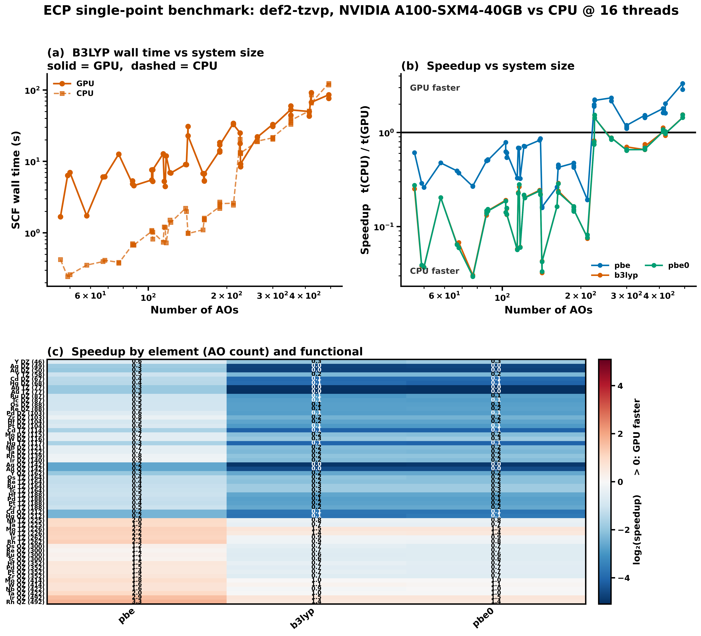

# ECP single-point benchmark: GPU4PySCF vs PySCF

19 closed-shell transition-metal complexes, each carrying a def2-ECP, run at 3 bases (DZ, TZ, QZ) with 3 functionals on both devices. No 5Z rung: gpu4pyscf's ECP kernels stop at g functions (see `systems_tm.py`).

> [!NOTE]
> Geometries are idealized VSEPR shapes with tabulated bond lengths, not optimized. Both devices see identical coordinates, so GPU/CPU comparisons are exact; the absolute energies are not thermochemical reference values.

## Settings

| key | value |
|---|---|
| systems | `tm` |
| method | `auto` |
| basis | `def2-tzvp` |
| grid | `[75, 302]` |
| conv_tol | `1e-09` |
| max_cycle | `100` |
| density_fit | `False` |
| conv_aids | `True` |
| cpu_threads | `16` |
| repeat | `1` |
| gpu | `NVIDIA A100-SXM4-40GB` |
| contract_engine | `cupy` |
| cupy | `13.6.0` |
| pyscf | `2.13.0` |
| gpu4pyscf | `1.8.1` |
| git_commit | `44f675287` |
| hostname | `nid001297` |
| slurm_job_id | `59130165` |
| timestamp | `2026-09-30T22:17:59-0700` |
| functionals | `pbe b3lyp pbe0` |

CPU references are built fresh from the Mole (`pyscf.dft.RKS` / `pyscf.dft.UKS`), never via `to_cpu()` of a converged GPU object -- that inherits the GPU density and biases CPU timings low by ~6x. The restricted/unrestricted choice depends only on the molecule and the `--method` flag, so both devices always run the same flavour.

## Failures

None: every run converged on both devices.

## GPU vs CPU energy agreement

Worst |E_GPU - E_CPU| across functionals, per system. Threshold 1e-08 Ha.

| system | compound | chg | 2S | SCF | natm | nao | max abs dE (Ha) | worst functional | status |
|---|---|---:|---:|---|---:|---:|---:|---|---|
| Y DZ | YH3 | +0 | 0 | RKS | 4 | 46 | 2.64e-12 | pbe0 | ok |
| Zr DZ | ZrCl4 | +0 | 0 | RKS | 5 | 103 | 4.46e-11 | pbe | ok |
| Nb DZ | NbCl5 | +0 | 0 | RKS | 6 | 121 | 1.06e-10 | pbe0 | ok |
| Mo DZ | MoF6 | +0 | 0 | RKS | 7 | 115 | 4.91e-11 | pbe | ok |
| Tc DZ | TcO4- | -1 | 0 | RKS | 5 | 87 | 7.71e-11 | b3lyp | ok |
| Ru DZ | RuO4 | +0 | 0 | RKS | 5 | 87 | 2.58e-10 | pbe | ok |
| Rh DZ | RhCl6_3- | -3 | 0 | RKS | 7 | 139 | 1.60e-10 | pbe0 | ok |
| Pd DZ | PdCl4_2- | -2 | 0 | RKS | 5 | 103 | 1.27e-10 | b3lyp | ok |
| Ag DZ | AgCl | +0 | 0 | RKS | 2 | 49 | 2.06e-11 | pbe0 | ok |
| Cd DZ | CdCl2 | +0 | 0 | RKS | 3 | 67 | 7.00e-11 | pbe | ok |
| Hf DZ | HfCl4 | +0 | 0 | RKS | 5 | 104 | 1.04e-10 | pbe | ok |
| Ta DZ | TaCl5 | +0 | 0 | RKS | 6 | 122 | 3.82e-10 | pbe | ok |
| W DZ | WF6 | +0 | 0 | RKS | 7 | 116 | 4.27e-11 | pbe0 | ok |
| Re DZ | ReO4- | -1 | 0 | RKS | 5 | 88 | 8.41e-11 | pbe0 | ok |
| Os DZ | OsO4 | +0 | 0 | RKS | 5 | 88 | 1.51e-10 | pbe | ok |
| Ir DZ | IrCl6_3- | -3 | 0 | RKS | 7 | 140 | 8.14e-11 | pbe0 | ok |
| Pt DZ | PtCl4_2- | -2 | 0 | RKS | 5 | 104 | 8.37e-11 | pbe0 | ok |
| Au DZ | AuCl | +0 | 0 | RKS | 2 | 50 | 1.46e-11 | pbe0 | ok |
| Hg DZ | HgCl2 | +0 | 0 | RKS | 3 | 68 | 3.23e-11 | pbe0 | ok |
| Y TZ | YH3 | +0 | 0 | RKS | 4 | 58 | 6.57e-12 | b3lyp | ok |
| Zr TZ | ZrCl4 | +0 | 0 | RKS | 5 | 188 | 1.69e-10 | pbe0 | ok |
| Nb TZ | NbCl5 | +0 | 0 | RKS | 6 | 225 | 9.09e-11 | pbe0 | ok |
| Mo TZ | MoF6 | +0 | 0 | RKS | 7 | 226 | 6.34e-11 | b3lyp | ok |
| Tc TZ | TcO4- | -1 | 0 | RKS | 5 | 164 | 1.71e-10 | pbe | ok |
| Ru TZ | RuO4 | +0 | 0 | RKS | 5 | 164 | 8.32e-11 | b3lyp | ok |
| Rh TZ | RhCl6_3- | -3 | 0 | RKS | 7 | 262 | 2.12e-10 | pbe0 | ok |
| Pd TZ | PdCl4_2- | -2 | 0 | RKS | 5 | 188 | 1.07e-10 | pbe | ok |
| Ag TZ | AgCl | +0 | 0 | RKS | 2 | 77 | 1.69e-11 | pbe | ok |
| Cd TZ | CdCl2 | +0 | 0 | RKS | 3 | 114 | 4.21e-11 | b3lyp | ok |
| Hf TZ | HfCl4 | +0 | 0 | RKS | 5 | 188 | 1.96e-10 | pbe0 | ok |
| Ta TZ | TaCl5 | +0 | 0 | RKS | 6 | 225 | 1.09e-10 | b3lyp | ok |
| W TZ | WF6 | +0 | 0 | RKS | 7 | 226 | 8.73e-11 | pbe | ok |
| Re TZ | ReO4- | -1 | 0 | RKS | 5 | 164 | 1.06e-10 | pbe | ok |
| Os TZ | OsO4 | +0 | 0 | RKS | 5 | 164 | 1.31e-10 | pbe0 | ok |
| Ir TZ | IrCl6_3- | -3 | 0 | RKS | 7 | 262 | 2.32e-10 | b3lyp | ok |
| Pt TZ | PtCl4_2- | -2 | 0 | RKS | 5 | 188 | 8.91e-11 | b3lyp | ok |
| Au TZ | AuCl | +0 | 0 | RKS | 2 | 77 | 1.38e-11 | b3lyp | ok |
| Hg TZ | HgCl2 | +0 | 0 | RKS | 3 | 117 | 2.98e-11 | b3lyp | ok |
| Y QZ | YH3 | +0 | 0 | RKS | 4 | 162 | 4.32e-12 | b3lyp | ok |
| Zr QZ | ZrCl4 | +0 | 0 | RKS | 5 | 352 | 4.97e-10 | pbe0 | ok |
| Nb QZ | NbCl5 | +0 | 0 | RKS | 6 | 422 | 2.52e-10 | pbe | ok |
| Mo QZ | MoF6 | +0 | 0 | RKS | 7 | 414 | 1.28e-10 | b3lyp | ok |
| Tc QZ | TcO4- | -1 | 0 | RKS | 5 | 300 | 2.94e-10 | pbe | ok |
| Ru QZ | RuO4 | +0 | 0 | RKS | 5 | 300 | 3.90e-10 | pbe | ok |
| Rh QZ | RhCl6_3- | -3 | 0 | RKS | 7 | 492 | 2.38e-09 | pbe | ok |
| Pd QZ | PdCl4_2- | -2 | 0 | RKS | 5 | 352 | 4.27e-10 | pbe | ok |
| Ag QZ | AgCl | +0 | 0 | RKS | 2 | 142 | 3.46e-11 | pbe0 | ok |
| Cd QZ | CdCl2 | +0 | 0 | RKS | 3 | 212 | 1.96e-10 | b3lyp | ok |
| Hf QZ | HfCl4 | +0 | 0 | RKS | 5 | 352 | 8.03e-10 | pbe | ok |
| Ta QZ | TaCl5 | +0 | 0 | RKS | 6 | 422 | 2.47e-10 | pbe | ok |
| W QZ | WF6 | +0 | 0 | RKS | 7 | 414 | 9.09e-11 | pbe0 | ok |
| Re QZ | ReO4- | -1 | 0 | RKS | 5 | 300 | 2.11e-10 | b3lyp | ok |
| Os QZ | OsO4 | +0 | 0 | RKS | 5 | 300 | 2.07e-10 | pbe0 | ok |
| Ir QZ | IrCl6_3- | -3 | 0 | RKS | 7 | 492 | 5.02e-10 | b3lyp | ok |
| Pt QZ | PtCl4_2- | -2 | 0 | RKS | 5 | 352 | 2.46e-10 | pbe0 | ok |
| Au QZ | AuCl | +0 | 0 | RKS | 2 | 142 | 7.71e-11 | pbe | ok |
| Hg QZ | HgCl2 | +0 | 0 | RKS | 3 | 212 | 5.53e-11 | pbe0 | ok |

## Speedup (CPU wall time / GPU wall time)

CPU at 16 threads, single GPU. Values below 1.00 mean the CPU was faster.

| system | compound | nao | pbe | b3lyp | pbe0 | mean |
|---|---|---:|---:|---:|---:|---:|
| Y DZ | YH3 | 46 | 0.61 | 0.25 | 0.27 | 0.38 |
| Zr DZ | ZrCl4 | 103 | 0.79 | 0.19 | 0.19 | 0.39 |
| Nb DZ | NbCl5 | 121 | 0.72 | 0.22 | 0.22 | 0.38 |
| Mo DZ | MoF6 | 115 | 0.69 | 0.23 | 0.23 | 0.38 |
| Tc DZ | TcO4- | 87 | 0.50 | 0.14 | 0.14 | 0.26 |
| Ru DZ | RuO4 | 87 | 0.50 | 0.13 | 0.15 | 0.26 |
| Rh DZ | RhCl6_3- | 139 | 0.83 | 0.24 | 0.24 | 0.44 |
| Pd DZ | PdCl4_2- | 103 | 0.63 | 0.14 | 0.14 | 0.30 |
| Ag DZ | AgCl | 49 | 0.29 | 0.04 | 0.04 | 0.12 |
| Cd DZ | CdCl2 | 67 | 0.39 | 0.07 | 0.06 | 0.17 |
| Hf DZ | HfCl4 | 104 | 0.54 | 0.16 | 0.16 | 0.28 |
| Ta DZ | TaCl5 | 122 | 0.71 | 0.20 | 0.20 | 0.37 |
| W DZ | WF6 | 116 | 0.68 | 0.27 | 0.28 | 0.41 |
| Re DZ | ReO4- | 88 | 0.51 | 0.15 | 0.15 | 0.27 |
| Os DZ | OsO4 | 88 | 0.51 | 0.15 | 0.15 | 0.27 |
| Ir DZ | IrCl6_3- | 140 | 0.86 | 0.22 | 0.22 | 0.43 |
| Pt DZ | PtCl4_2- | 104 | 0.61 | 0.13 | 0.13 | 0.29 |
| Au DZ | AuCl | 50 | 0.26 | 0.04 | 0.04 | 0.11 |
| Hg DZ | HgCl2 | 68 | 0.37 | 0.07 | 0.06 | 0.17 |
| Y TZ | YH3 | 58 | 0.48 | 0.20 | 0.20 | 0.29 |
| Zr TZ | ZrCl4 | 188 | 0.47 | 0.16 | 0.16 | 0.27 |
| Nb TZ | NbCl5 | 225 | 1.98 | 0.82 | 0.80 | 1.20 |
| Mo TZ | MoF6 | 226 | 2.24 | 1.53 | 1.54 | 1.77 |
| Tc TZ | TcO4- | 164 | 0.45 | 0.29 | 0.29 | 0.34 |
| Ru TZ | RuO4 | 164 | 0.45 | 0.29 | 0.29 | 0.34 |
| Rh TZ | RhCl6_3- | 262 | 2.34 | 0.86 | 0.84 | 1.34 |
| Pd TZ | PdCl4_2- | 188 | 0.44 | 0.15 | 0.15 | 0.24 |
| Ag TZ | AgCl | 77 | 0.27 | 0.03 | 0.03 | 0.11 |
| Cd TZ | CdCl2 | 114 | 0.33 | 0.06 | 0.06 | 0.15 |
| Hf TZ | HfCl4 | 188 | 0.47 | 0.16 | 0.16 | 0.27 |
| Ta TZ | TaCl5 | 225 | 1.89 | 0.75 | 0.75 | 1.13 |
| W TZ | WF6 | 226 | 2.19 | 1.42 | 1.43 | 1.68 |
| Re TZ | ReO4- | 164 | 0.42 | 0.23 | 0.23 | 0.30 |
| Os TZ | OsO4 | 164 | 0.43 | 0.24 | 0.23 | 0.30 |
| Ir TZ | IrCl6_3- | 262 | 2.16 | 0.88 | 0.87 | 1.30 |
| Pt TZ | PtCl4_2- | 188 | 0.43 | 0.15 | 0.15 | 0.24 |
| Au TZ | AuCl | 77 | 0.27 | 0.03 | 0.03 | 0.11 |
| Hg TZ | HgCl2 | 117 | 0.32 | 0.06 | 0.06 | 0.15 |
| Y QZ | YH3 | 162 | 0.26 | 0.16 | 0.16 | 0.20 |
| Zr QZ | ZrCl4 | 352 | 1.52 | 0.66 | 0.66 | 0.95 |
| Nb QZ | NbCl5 | 422 | 1.61 | 0.93 | 1.02 | 1.19 |
| Mo QZ | MoF6 | 414 | 1.80 | 1.02 | 1.02 | 1.28 |
| Tc QZ | TcO4- | 300 | 1.14 | 0.65 | 0.65 | 0.81 |
| Ru QZ | RuO4 | 300 | 1.15 | 0.64 | 0.64 | 0.81 |
| Rh QZ | RhCl6_3- | 492 | 3.33 | 1.45 | 1.44 | 2.07 |
| Pd QZ | PdCl4_2- | 352 | 1.46 | 0.67 | 0.67 | 0.93 |
| Ag QZ | AgCl | 142 | 0.16 | 0.03 | 0.03 | 0.07 |
| Cd QZ | CdCl2 | 212 | 0.19 | 0.08 | 0.08 | 0.12 |
| Hf QZ | HfCl4 | 352 | 1.48 | 0.75 | 0.69 | 0.97 |
| Ta QZ | TaCl5 | 422 | 2.03 | 0.98 | 0.97 | 1.33 |
| W QZ | WF6 | 414 | 1.62 | 1.12 | 1.07 | 1.27 |
| Re QZ | ReO4- | 300 | 1.10 | 0.66 | 0.66 | 0.81 |
| Os QZ | OsO4 | 300 | 1.19 | 0.70 | 0.66 | 0.85 |
| Ir QZ | IrCl6_3- | 492 | 2.86 | 1.55 | 1.55 | 1.98 |
| Pt QZ | PtCl4_2- | 352 | 1.44 | 0.71 | 0.66 | 0.94 |
| Au QZ | AuCl | 142 | 0.16 | 0.04 | 0.04 | 0.08 |
| Hg QZ | HgCl2 | 212 | 0.19 | 0.07 | 0.08 | 0.12 |

## Per-basis summary

Median speedup at each rung of the ladder, per functional, over every system that paired. `nao` is the range of AO counts at that rung.

| basis | nao | pbe | b3lyp | pbe0 | GPU faster in |
|---|---|---:|---:|---:|---:|
| DZ | 46-140 | 0.61 | 0.15 | 0.15 | 0/57 |
| TZ | 58-262 | 0.45 | 0.23 | 0.23 | 10/57 |
| QZ | 142-492 | 1.44 | 0.67 | 0.66 | 23/57 |

## Per-functional summary

| functional | systems | mean speedup | median speedup | total GPU (s) | total CPU (s) | max abs dE (Ha) |
|---|---:|---:|---:|---:|---:|---:|
| pbe | 57 | 0.94 | 0.61 | 536.2 | 841.4 | 2.38e-09 |
| b3lyp | 57 | 0.42 | 0.22 | 1235.6 | 863.7 | 5.02e-10 |
| pbe0 | 57 | 0.42 | 0.22 | 1208.8 | 839.6 | 7.76e-10 |

## Full results

Every per-device column is `GPU/CPU`. `conv` is the SCF convergence flag, `cyc` the cycle count and `<S^2>` the converged spin expectation -- the three numbers to read together when a run looks wrong. A **NO** in `conv` means that device hit the cycle cap, so its energy and any `dE` built from it are not converged values.

| element | compound | basis | 2S | SCF | nao | functional | E_GPU (Ha) | E_CPU (Ha) | dE (Ha) | t_GPU (s) | t_CPU (s) | speedup | conv | cyc | <S^2> |
|---|---|---|---:|---|---:|---|---:|---:|---:|---:|---:|---:|---|---:|---:|
| Y | YH3 | DZ | 0 | RKS | 46 | b3lyp | -40.04950001 | -40.04950001 | 1.46e-12 | 1.68 | 0.42 | 0.25 | yes/yes | 8/8 | --/-- |
| Y | YH3 | DZ | 0 | RKS | 46 | pbe | -40.01437965 | -40.01437965 | 4.33e-13 | 0.69 | 0.42 | 0.61 | yes/yes | 8/8 | --/-- |
| Y | YH3 | DZ | 0 | RKS | 46 | pbe0 | -40.00759843 | -40.00759843 | 2.64e-12 | 1.48 | 0.41 | 0.27 | yes/yes | 8/8 | --/-- |
| Ag | AgCl | DZ | 0 | RKS | 49 | b3lyp | -607.10501836 | -607.10501836 | 1.38e-11 | 6.37 | 0.24 | 0.04 | yes/yes | 11/11 | --/-- |
| Ag | AgCl | DZ | 0 | RKS | 49 | pbe | -606.85953781 | -606.85953781 | 2.61e-12 | 0.88 | 0.26 | 0.29 | yes/yes | 12/12 | --/-- |
| Ag | AgCl | DZ | 0 | RKS | 49 | pbe0 | -606.88214029 | -606.88214029 | 2.06e-11 | 5.86 | 0.23 | 0.04 | yes/yes | 10/10 | --/-- |
| Au | AuCl | DZ | 0 | RKS | 50 | b3lyp | -595.85555855 | -595.85555855 | 1.27e-11 | 7.00 | 0.26 | 0.04 | yes/yes | 11/11 | --/-- |
| Au | AuCl | DZ | 0 | RKS | 50 | pbe | -595.64483619 | -595.64483619 | 7.96e-12 | 0.91 | 0.24 | 0.26 | yes/yes | 11/11 | --/-- |
| Au | AuCl | DZ | 0 | RKS | 50 | pbe0 | -595.63558532 | -595.63558532 | 1.46e-11 | 6.96 | 0.26 | 0.04 | yes/yes | 11/11 | --/-- |
| Y | YH3 | TZ | 0 | RKS | 58 | b3lyp | -40.06567018 | -40.06567018 | 6.57e-12 | 1.74 | 0.35 | 0.20 | yes/yes | 8/8 | --/-- |
| Y | YH3 | TZ | 0 | RKS | 58 | pbe | -40.02950655 | -40.02950655 | 1.15e-12 | 0.78 | 0.37 | 0.48 | yes/yes | 9/9 | --/-- |
| Y | YH3 | TZ | 0 | RKS | 58 | pbe0 | -40.02205093 | -40.02205093 | 4.43e-12 | 1.71 | 0.35 | 0.20 | yes/yes | 8/8 | --/-- |
| Cd | CdCl2 | DZ | 0 | RKS | 67 | b3lyp | -1088.01233551 | -1088.01233551 | 3.46e-11 | 6.07 | 0.40 | 0.07 | yes/yes | 10/10 | --/-- |
| Cd | CdCl2 | DZ | 0 | RKS | 67 | pbe | -1087.55346790 | -1087.55346790 | 7.00e-11 | 0.91 | 0.36 | 0.39 | yes/yes | 9/9 | --/-- |
| Cd | CdCl2 | DZ | 0 | RKS | 67 | pbe0 | -1087.62427955 | -1087.62427955 | 2.59e-11 | 5.54 | 0.36 | 0.06 | yes/yes | 9/9 | --/-- |
| Hg | HgCl2 | DZ | 0 | RKS | 68 | b3lyp | -1073.73068653 | -1073.73068653 | 3.12e-11 | 6.10 | 0.41 | 0.07 | yes/yes | 9/9 | --/-- |
| Hg | HgCl2 | DZ | 0 | RKS | 68 | pbe | -1073.30877797 | -1073.30877797 | 1.86e-11 | 1.06 | 0.39 | 0.37 | yes/yes | 10/10 | --/-- |
| Hg | HgCl2 | DZ | 0 | RKS | 68 | pbe0 | -1073.34703000 | -1073.34703000 | 3.23e-11 | 6.17 | 0.37 | 0.06 | yes/yes | 9/9 | --/-- |
| Ag | AgCl | TZ | 0 | RKS | 77 | b3lyp | -607.30263090 | -607.30263090 | 5.68e-13 | 12.66 | 0.39 | 0.03 | yes/yes | 12/12 | --/-- |
| Ag | AgCl | TZ | 0 | RKS | 77 | pbe | -607.05748082 | -607.05748082 | 1.69e-11 | 1.46 | 0.39 | 0.27 | yes/yes | 13/13 | --/-- |
| Ag | AgCl | TZ | 0 | RKS | 77 | pbe0 | -607.07669927 | -607.07669927 | 1.40e-11 | 12.55 | 0.37 | 0.03 | yes/yes | 12/12 | --/-- |
| Au | AuCl | TZ | 0 | RKS | 77 | b3lyp | -596.02434415 | -596.02434415 | 1.38e-11 | 12.54 | 0.38 | 0.03 | yes/yes | 12/12 | --/-- |
| Au | AuCl | TZ | 0 | RKS | 77 | pbe | -595.81423333 | -595.81423333 | 1.27e-11 | 1.37 | 0.37 | 0.27 | yes/yes | 11/11 | --/-- |
| Au | AuCl | TZ | 0 | RKS | 77 | pbe0 | -595.80317293 | -595.80317293 | 1.24e-11 | 12.50 | 0.37 | 0.03 | yes/yes | 12/12 | --/-- |
| Ru | RuO4 | DZ | 0 | RKS | 87 | b3lyp | -395.49132935 | -395.49132935 | 3.88e-11 | 5.35 | 0.71 | 0.13 | yes/yes | 10/10 | --/-- |
| Ru | RuO4 | DZ | 0 | RKS | 87 | pbe | -395.29154287 | -395.29154287 | 2.58e-10 | 1.29 | 0.65 | 0.50 | yes/yes | 9/9 | --/-- |
| Ru | RuO4 | DZ | 0 | RKS | 87 | pbe0 | -395.11546172 | -395.11546172 | 2.49e-10 | 4.75 | 0.70 | 0.15 | yes/yes | 9/9 | --/-- |
| Tc | TcO4- | DZ | 0 | RKS | 87 | b3lyp | -381.65779518 | -381.65779518 | 7.71e-11 | 4.82 | 0.68 | 0.14 | yes/yes | 9/9 | --/-- |
| Tc | TcO4- | DZ | 0 | RKS | 87 | pbe | -381.42470043 | -381.42470043 | 5.51e-11 | 1.39 | 0.70 | 0.50 | yes/yes | 10/10 | --/-- |
| Tc | TcO4- | DZ | 0 | RKS | 87 | pbe0 | -381.29504768 | -381.29504768 | 5.09e-11 | 4.89 | 0.67 | 0.14 | yes/yes | 9/9 | --/-- |
| Os | OsO4 | DZ | 0 | RKS | 88 | b3lyp | -391.37382529 | -391.37382529 | 9.37e-11 | 4.57 | 0.67 | 0.15 | yes/yes | 9/9 | --/-- |
| Os | OsO4 | DZ | 0 | RKS | 88 | pbe | -391.17078087 | -391.17078087 | 1.51e-10 | 1.28 | 0.65 | 0.51 | yes/yes | 9/9 | --/-- |
| Os | OsO4 | DZ | 0 | RKS | 88 | pbe0 | -391.01112045 | -391.01112045 | 1.02e-10 | 4.50 | 0.66 | 0.15 | yes/yes | 9/9 | --/-- |
| Re | ReO4- | DZ | 0 | RKS | 88 | b3lyp | -379.20012882 | -379.20012882 | 8.19e-11 | 4.57 | 0.67 | 0.15 | yes/yes | 9/9 | --/-- |
| Re | ReO4- | DZ | 0 | RKS | 88 | pbe | -378.96612961 | -378.96612961 | 1.92e-11 | 1.38 | 0.71 | 0.51 | yes/yes | 10/10 | --/-- |
| Re | ReO4- | DZ | 0 | RKS | 88 | pbe0 | -378.84435004 | -378.84435004 | 8.41e-11 | 4.54 | 0.69 | 0.15 | yes/yes | 9/9 | --/-- |
| Pd | PdCl4_2- | DZ | 0 | RKS | 103 | b3lyp | -1968.36274312 | -1968.36274312 | 1.27e-10 | 7.62 | 1.08 | 0.14 | yes/yes | 11/11 | --/-- |
| Pd | PdCl4_2- | DZ | 0 | RKS | 103 | pbe | -1967.53352874 | -1967.53352874 | 5.91e-11 | 1.66 | 1.04 | 0.63 | yes/yes | 11/11 | --/-- |
| Pd | PdCl4_2- | DZ | 0 | RKS | 103 | pbe0 | -1967.65532396 | -1967.65532396 | 8.28e-11 | 7.62 | 1.08 | 0.14 | yes/yes | 11/11 | --/-- |
| Zr | ZrCl4 | DZ | 0 | RKS | 103 | b3lyp | -1887.67282375 | -1887.67282375 | 1.23e-11 | 5.49 | 1.05 | 0.19 | yes/yes | 9/9 | --/-- |
| Zr | ZrCl4 | DZ | 0 | RKS | 103 | pbe | -1886.86354204 | -1886.86354204 | 4.46e-11 | 1.48 | 1.16 | 0.79 | yes/yes | 9/9 | --/-- |
| Zr | ZrCl4 | DZ | 0 | RKS | 103 | pbe0 | -1886.98700572 | -1886.98700572 | 1.27e-11 | 5.45 | 1.02 | 0.19 | yes/yes | 9/9 | --/-- |
| Hf | HfCl4 | DZ | 0 | RKS | 104 | b3lyp | -1888.63956037 | -1888.63956037 | 2.14e-11 | 5.27 | 0.82 | 0.16 | yes/yes | 8/8 | --/-- |
| Hf | HfCl4 | DZ | 0 | RKS | 104 | pbe | -1887.83510444 | -1887.83510444 | 1.04e-10 | 1.51 | 0.81 | 0.54 | yes/yes | 9/8 | --/-- |
| Hf | HfCl4 | DZ | 0 | RKS | 104 | pbe0 | -1887.95203996 | -1887.95203996 | 2.09e-11 | 5.35 | 0.84 | 0.16 | yes/yes | 8/8 | --/-- |
| Pt | PtCl4_2- | DZ | 0 | RKS | 104 | b3lyp | -1959.82016805 | -1959.82016805 | 7.55e-11 | 7.63 | 1.02 | 0.13 | yes/yes | 10/10 | --/-- |
| Pt | PtCl4_2- | DZ | 0 | RKS | 104 | pbe | -1959.01819433 | -1959.01819433 | 4.41e-11 | 1.62 | 0.99 | 0.61 | yes/yes | 10/10 | --/-- |
| Pt | PtCl4_2- | DZ | 0 | RKS | 104 | pbe0 | -1959.12156887 | -1959.12156887 | 8.37e-11 | 7.58 | 1.02 | 0.13 | yes/yes | 10/10 | --/-- |
| Cd | CdCl2 | TZ | 0 | RKS | 114 | b3lyp | -1088.37470025 | -1088.37470025 | 4.21e-11 | 12.80 | 0.74 | 0.06 | yes/yes | 11/11 | --/-- |
| Cd | CdCl2 | TZ | 0 | RKS | 114 | pbe | -1087.91614253 | -1087.91614253 | 1.00e-11 | 2.27 | 0.74 | 0.33 | yes/yes | 12/12 | --/-- |
| Cd | CdCl2 | TZ | 0 | RKS | 114 | pbe0 | -1087.98174801 | -1087.98174801 | 2.64e-11 | 12.66 | 0.72 | 0.06 | yes/yes | 11/11 | --/-- |
| Mo | MoF6 | DZ | 0 | RKS | 115 | b3lyp | -667.01196277 | -667.01196277 | 8.19e-12 | 5.26 | 1.21 | 0.23 | yes/yes | 9/9 | --/-- |
| Mo | MoF6 | DZ | 0 | RKS | 115 | pbe | -666.51381192 | -666.51381192 | 4.91e-11 | 1.73 | 1.19 | 0.69 | yes/yes | 9/9 | --/-- |
| Mo | MoF6 | DZ | 0 | RKS | 115 | pbe0 | -666.40408895 | -666.40408895 | 8.19e-12 | 5.29 | 1.19 | 0.23 | yes/yes | 9/9 | --/-- |
| W | WF6 | DZ | 0 | RKS | 116 | b3lyp | -665.97628906 | -665.97628906 | 2.59e-11 | 4.47 | 1.19 | 0.27 | yes/yes | 9/9 | --/-- |
| W | WF6 | DZ | 0 | RKS | 116 | pbe | -665.47120937 | -665.47120937 | 4.02e-11 | 1.73 | 1.18 | 0.68 | yes/yes | 9/9 | --/-- |
| W | WF6 | DZ | 0 | RKS | 116 | pbe0 | -665.37327867 | -665.37327867 | 4.27e-11 | 4.23 | 1.19 | 0.28 | yes/yes | 9/9 | --/-- |
| Hg | HgCl2 | TZ | 0 | RKS | 117 | b3lyp | -1074.06755214 | -1074.06755214 | 2.98e-11 | 11.94 | 0.72 | 0.06 | yes/yes | 10/10 | --/-- |
| Hg | HgCl2 | TZ | 0 | RKS | 117 | pbe | -1073.64640242 | -1073.64640242 | 2.48e-11 | 2.28 | 0.74 | 0.32 | yes/yes | 11/11 | --/-- |
| Hg | HgCl2 | TZ | 0 | RKS | 117 | pbe0 | -1073.68113092 | -1073.68113092 | 2.61e-11 | 11.86 | 0.71 | 0.06 | yes/yes | 10/10 | --/-- |
| Nb | NbCl5 | DZ | 0 | RKS | 121 | b3lyp | -2357.62231729 | -2357.62231729 | 3.68e-11 | 6.96 | 1.51 | 0.22 | yes/yes | 11/11 | --/-- |
| Nb | NbCl5 | DZ | 0 | RKS | 121 | pbe | -2356.63673171 | -2356.63673171 | 3.37e-11 | 3.04 | 2.18 | 0.72 | yes/yes | 17/17 | --/-- |
| Nb | NbCl5 | DZ | 0 | RKS | 121 | pbe0 | -2356.77079479 | -2356.77079479 | 1.06e-10 | 6.99 | 1.51 | 0.22 | yes/yes | 11/11 | --/-- |
| Ta | TaCl5 | DZ | 0 | RKS | 122 | b3lyp | -2357.68504269 | -2357.68504269 | 7.87e-11 | 6.88 | 1.41 | 0.20 | yes/yes | 10/10 | --/-- |
| Ta | TaCl5 | DZ | 0 | RKS | 122 | pbe | -2356.70246244 | -2356.70246244 | 3.82e-10 | 1.95 | 1.39 | 0.71 | yes/yes | 10/10 | --/-- |
| Ta | TaCl5 | DZ | 0 | RKS | 122 | pbe0 | -2356.83481436 | -2356.83481436 | 1.10e-10 | 6.88 | 1.39 | 0.20 | yes/yes | 10/10 | --/-- |
| Rh | RhCl6_3- | DZ | 0 | RKS | 139 | b3lyp | -2871.02053717 | -2871.02053717 | 1.47e-10 | 9.06 | 2.21 | 0.24 | yes/yes | 12/12 | --/-- |
| Rh | RhCl6_3- | DZ | 0 | RKS | 139 | pbe | -2869.79984343 | -2869.79984343 | 3.18e-11 | 2.45 | 2.03 | 0.83 | yes/yes | 12/12 | --/-- |
| Rh | RhCl6_3- | DZ | 0 | RKS | 139 | pbe0 | -2869.99608895 | -2869.99608895 | 1.60e-10 | 9.08 | 2.17 | 0.24 | yes/yes | 12/12 | --/-- |
| Ir | IrCl6_3- | DZ | 0 | RKS | 140 | b3lyp | -2864.80719789 | -2864.80719789 | 2.05e-11 | 9.02 | 1.99 | 0.22 | yes/yes | 11/11 | --/-- |
| Ir | IrCl6_3- | DZ | 0 | RKS | 140 | pbe | -2863.60914522 | -2863.60914522 | 6.82e-12 | 2.27 | 1.96 | 0.86 | yes/yes | 11/12 | --/-- |
| Ir | IrCl6_3- | DZ | 0 | RKS | 140 | pbe0 | -2863.79657150 | -2863.79657150 | 8.14e-11 | 9.05 | 1.98 | 0.22 | yes/yes | 11/11 | --/-- |
| Ag | AgCl | QZ | 0 | RKS | 142 | b3lyp | -607.32182674 | -607.32182674 | 1.84e-11 | 30.88 | 1.00 | 0.03 | yes/yes | 13/13 | --/-- |
| Ag | AgCl | QZ | 0 | RKS | 142 | pbe | -607.07660781 | -607.07660781 | 1.83e-11 | 5.58 | 0.88 | 0.16 | yes/yes | 13/13 | --/-- |
| Ag | AgCl | QZ | 0 | RKS | 142 | pbe0 | -607.09446061 | -607.09446061 | 3.46e-11 | 30.90 | 1.03 | 0.03 | yes/yes | 13/13 | --/-- |
| Au | AuCl | QZ | 0 | RKS | 142 | b3lyp | -596.04185764 | -596.04185764 | 1.14e-12 | 22.78 | 0.98 | 0.04 | yes/yes | 12/12 | --/-- |
| Au | AuCl | QZ | 0 | RKS | 142 | pbe | -595.83166919 | -595.83166919 | 7.71e-11 | 5.21 | 0.84 | 0.16 | yes/yes | 12/12 | --/-- |
| Au | AuCl | QZ | 0 | RKS | 142 | pbe0 | -595.81949051 | -595.81949051 | 4.37e-11 | 22.80 | 0.96 | 0.04 | yes/yes | 12/12 | --/-- |
| Y | YH3 | QZ | 0 | RKS | 162 | b3lyp | -40.06946492 | -40.06946492 | 4.32e-12 | 6.76 | 1.10 | 0.16 | yes/yes | 8/8 | --/-- |
| Y | YH3 | QZ | 0 | RKS | 162 | pbe | -40.03333571 | -40.03333571 | 1.92e-13 | 3.87 | 1.02 | 0.26 | yes/yes | 9/9 | --/-- |
| Y | YH3 | QZ | 0 | RKS | 162 | pbe0 | -40.02623303 | -40.02623303 | 1.98e-12 | 6.74 | 1.10 | 0.16 | yes/yes | 8/8 | --/-- |
| Os | OsO4 | TZ | 0 | RKS | 164 | b3lyp | -391.77226224 | -391.77226224 | 3.66e-11 | 6.74 | 1.61 | 0.24 | yes/yes | 9/9 | --/-- |
| Os | OsO4 | TZ | 0 | RKS | 164 | pbe | -391.56342480 | -391.56342480 | 1.23e-10 | 3.28 | 1.40 | 0.43 | yes/yes | 9/9 | --/-- |
| Os | OsO4 | TZ | 0 | RKS | 164 | pbe0 | -391.41077284 | -391.41077284 | 1.31e-10 | 6.72 | 1.55 | 0.23 | yes/yes | 9/9 | --/-- |
| Re | ReO4- | TZ | 0 | RKS | 164 | b3lyp | -379.60210507 | -379.60210507 | 1.09e-11 | 6.75 | 1.56 | 0.23 | yes/yes | 9/9 | --/-- |
| Re | ReO4- | TZ | 0 | RKS | 164 | pbe | -379.36143661 | -379.36143661 | 1.06e-10 | 3.57 | 1.51 | 0.42 | yes/yes | 10/10 | --/-- |
| Re | ReO4- | TZ | 0 | RKS | 164 | pbe0 | -379.24379183 | -379.24379183 | 5.51e-11 | 6.74 | 1.56 | 0.23 | yes/yes | 9/9 | --/-- |
| Ru | RuO4 | TZ | 0 | RKS | 164 | b3lyp | -395.89448397 | -395.89448397 | 8.32e-11 | 5.31 | 1.52 | 0.29 | yes/yes | 9/9 | --/-- |
| Ru | RuO4 | TZ | 0 | RKS | 164 | pbe | -395.68843446 | -395.68843446 | 6.07e-11 | 3.31 | 1.48 | 0.45 | yes/yes | 10/10 | --/-- |
| Ru | RuO4 | TZ | 0 | RKS | 164 | pbe0 | -395.51803687 | -395.51803687 | 8.16e-11 | 5.33 | 1.52 | 0.29 | yes/yes | 9/9 | --/-- |
| Tc | TcO4- | TZ | 0 | RKS | 164 | b3lyp | -382.06296049 | -382.06296049 | 1.01e-10 | 5.37 | 1.55 | 0.29 | yes/yes | 9/9 | --/-- |
| Tc | TcO4- | TZ | 0 | RKS | 164 | pbe | -381.82327963 | -381.82327963 | 1.71e-10 | 3.36 | 1.52 | 0.45 | yes/yes | 10/10 | --/-- |
| Tc | TcO4- | TZ | 0 | RKS | 164 | pbe0 | -381.69547693 | -381.69547693 | 1.21e-10 | 5.35 | 1.53 | 0.29 | yes/yes | 9/9 | --/-- |
| Hf | HfCl4 | TZ | 0 | RKS | 188 | b3lyp | -1889.28267065 | -1889.28267065 | 1.56e-10 | 13.55 | 2.19 | 0.16 | yes/yes | 9/9 | --/-- |
| Hf | HfCl4 | TZ | 0 | RKS | 188 | pbe | -1888.47884210 | -1888.47884210 | 7.73e-11 | 4.05 | 1.92 | 0.47 | yes/yes | 9/9 | --/-- |
| Hf | HfCl4 | TZ | 0 | RKS | 188 | pbe0 | -1888.59224431 | -1888.59224431 | 1.96e-10 | 13.61 | 2.18 | 0.16 | yes/yes | 9/9 | --/-- |
| Pd | PdCl4_2- | TZ | 0 | RKS | 188 | b3lyp | -1969.06369711 | -1969.06369711 | 2.55e-11 | 18.43 | 2.70 | 0.15 | yes/yes | 12/12 | --/-- |
| Pd | PdCl4_2- | TZ | 0 | RKS | 188 | pbe | -1968.23321514 | -1968.23321514 | 1.07e-10 | 5.22 | 2.30 | 0.44 | yes/yes | 12/12 | --/-- |
| Pd | PdCl4_2- | TZ | 0 | RKS | 188 | pbe0 | -1968.34261053 | -1968.34261053 | 1.86e-11 | 18.43 | 2.68 | 0.15 | yes/yes | 12/12 | --/-- |
| Pt | PtCl4_2- | TZ | 0 | RKS | 188 | b3lyp | -1960.50623848 | -1960.50623848 | 8.91e-11 | 16.98 | 2.56 | 0.15 | yes/yes | 11/11 | --/-- |
| Pt | PtCl4_2- | TZ | 0 | RKS | 188 | pbe | -1959.70316376 | -1959.70316376 | 7.00e-11 | 5.14 | 2.19 | 0.43 | yes/yes | 11/11 | --/-- |
| Pt | PtCl4_2- | TZ | 0 | RKS | 188 | pbe0 | -1959.79578635 | -1959.79578635 | 7.91e-11 | 16.96 | 2.56 | 0.15 | yes/yes | 11/11 | --/-- |
| Zr | ZrCl4 | TZ | 0 | RKS | 188 | b3lyp | -1888.31344696 | -1888.31344696 | 1.33e-10 | 14.20 | 2.33 | 0.16 | yes/yes | 10/10 | --/-- |
| Zr | ZrCl4 | TZ | 0 | RKS | 188 | pbe | -1887.50508633 | -1887.50508633 | 2.00e-11 | 4.28 | 2.02 | 0.47 | yes/yes | 10/10 | --/-- |
| Zr | ZrCl4 | TZ | 0 | RKS | 188 | pbe0 | -1887.62257957 | -1887.62257957 | 1.69e-10 | 14.21 | 2.33 | 0.16 | yes/yes | 10/10 | --/-- |
| Cd | CdCl2 | QZ | 0 | RKS | 212 | b3lyp | -1088.41081065 | -1088.41081065 | 1.96e-10 | 34.10 | 2.60 | 0.08 | yes/yes | 11/11 | --/-- |
| Cd | CdCl2 | QZ | 0 | RKS | 212 | pbe | -1087.95210403 | -1087.95210403 | 8.62e-11 | 10.79 | 2.08 | 0.19 | yes/yes | 12/12 | --/-- |
| Cd | CdCl2 | QZ | 0 | RKS | 212 | pbe0 | -1088.01546015 | -1088.01546015 | 3.96e-11 | 33.94 | 2.59 | 0.08 | yes/yes | 11/11 | --/-- |
| Hg | HgCl2 | QZ | 0 | RKS | 212 | b3lyp | -1074.09967958 | -1074.09967958 | 1.25e-11 | 32.89 | 2.45 | 0.07 | yes/yes | 11/10 | --/-- |
| Hg | HgCl2 | QZ | 0 | RKS | 212 | pbe | -1073.67842964 | -1073.67842964 | 2.96e-11 | 10.46 | 2.01 | 0.19 | yes/yes | 11/11 | --/-- |
| Hg | HgCl2 | QZ | 0 | RKS | 212 | pbe0 | -1073.71124907 | -1073.71124907 | 5.53e-11 | 30.20 | 2.47 | 0.08 | yes/yes | 10/10 | --/-- |
| Nb | NbCl5 | TZ | 0 | RKS | 225 | b3lyp | -2358.42695238 | -2358.42695238 | 7.78e-11 | 25.04 | 20.46 | 0.82 | yes/yes | 15/16 | --/-- |
| Nb | NbCl5 | TZ | 0 | RKS | 225 | pbe | -2357.44165814 | -2357.44165814 | 6.64e-11 | 13.73 | 27.15 | 1.98 | yes/yes | 23/23 | --/-- |
| Nb | NbCl5 | TZ | 0 | RKS | 225 | pbe0 | -2357.56963755 | -2357.56963755 | 9.09e-11 | 18.54 | 14.75 | 0.80 | yes/yes | 11/11 | --/-- |
| Ta | TaCl5 | TZ | 0 | RKS | 225 | b3lyp | -2358.49090933 | -2358.49090933 | 1.09e-10 | 17.81 | 13.33 | 0.75 | yes/yes | 10/10 | --/-- |
| Ta | TaCl5 | TZ | 0 | RKS | 225 | pbe | -2357.50872576 | -2357.50872576 | 5.00e-11 | 6.71 | 12.69 | 1.89 | yes/yes | 11/10 | --/-- |
| Ta | TaCl5 | TZ | 0 | RKS | 225 | pbe0 | -2357.63731249 | -2357.63731249 | 1.07e-10 | 17.78 | 13.26 | 0.75 | yes/yes | 10/10 | --/-- |
| Mo | MoF6 | TZ | 0 | RKS | 226 | b3lyp | -667.77289533 | -667.77289533 | 6.34e-11 | 8.40 | 12.82 | 1.53 | yes/yes | 10/10 | --/-- |
| Mo | MoF6 | TZ | 0 | RKS | 226 | pbe | -667.26416531 | -667.26416531 | 1.43e-11 | 5.00 | 11.17 | 2.24 | yes/yes | 9/9 | --/-- |
| Mo | MoF6 | TZ | 0 | RKS | 226 | pbe0 | -667.15970159 | -667.15970159 | 2.27e-11 | 7.80 | 11.97 | 1.54 | yes/yes | 9/9 | --/-- |
| W | WF6 | TZ | 0 | RKS | 226 | b3lyp | -666.74206013 | -666.74206013 | 1.50e-11 | 9.22 | 13.14 | 1.42 | yes/yes | 9/9 | --/-- |
| W | WF6 | TZ | 0 | RKS | 226 | pbe | -666.22755303 | -666.22755303 | 8.73e-11 | 5.63 | 12.35 | 2.19 | yes/yes | 10/9 | --/-- |
| W | WF6 | TZ | 0 | RKS | 226 | pbe0 | -666.13529384 | -666.13529384 | 2.50e-11 | 9.15 | 13.11 | 1.43 | yes/yes | 9/9 | --/-- |
| Ir | IrCl6_3- | TZ | 0 | RKS | 262 | b3lyp | -2865.84753941 | -2865.84753941 | 2.32e-10 | 21.87 | 19.21 | 0.88 | yes/yes | 11/11 | --/-- |
| Ir | IrCl6_3- | TZ | 0 | RKS | 262 | pbe | -2864.64818502 | -2864.64818502 | 4.55e-12 | 8.96 | 19.36 | 2.16 | yes/yes | 12/12 | --/-- |
| Ir | IrCl6_3- | TZ | 0 | RKS | 262 | pbe0 | -2864.81582791 | -2864.81582791 | 0.00e+00 | 21.88 | 19.14 | 0.87 | yes/yes | 11/11 | --/-- |
| Rh | RhCl6_3- | TZ | 0 | RKS | 262 | b3lyp | -2872.06132230 | -2872.06132230 | 5.05e-11 | 22.11 | 18.93 | 0.86 | yes/yes | 11/11 | --/-- |
| Rh | RhCl6_3- | TZ | 0 | RKS | 262 | pbe | -2870.83977958 | -2870.83977958 | 3.05e-11 | 8.62 | 20.14 | 2.34 | yes/yes | 12/13 | --/-- |
| Rh | RhCl6_3- | TZ | 0 | RKS | 262 | pbe0 | -2871.01511170 | -2871.01511170 | 2.12e-10 | 23.64 | 19.88 | 0.84 | yes/yes | 12/12 | --/-- |
| Os | OsO4 | QZ | 0 | RKS | 300 | b3lyp | -391.80001624 | -391.80001624 | 4.09e-11 | 30.86 | 21.69 | 0.70 | yes/yes | 9/10 | --/-- |
| Os | OsO4 | QZ | 0 | RKS | 300 | pbe | -391.59092725 | -391.59092725 | 1.24e-10 | 17.01 | 20.29 | 1.19 | yes/yes | 9/10 | --/-- |
| Os | OsO4 | QZ | 0 | RKS | 300 | pbe0 | -391.43811044 | -391.43811044 | 2.07e-10 | 30.77 | 20.20 | 0.66 | yes/yes | 9/9 | --/-- |
| Re | ReO4- | QZ | 0 | RKS | 300 | b3lyp | -379.63070468 | -379.63070468 | 2.11e-10 | 31.00 | 20.41 | 0.66 | yes/yes | 9/9 | --/-- |
| Re | ReO4- | QZ | 0 | RKS | 300 | pbe | -379.39034271 | -379.39034271 | 4.37e-11 | 18.62 | 20.52 | 1.10 | yes/yes | 10/10 | --/-- |
| Re | ReO4- | QZ | 0 | RKS | 300 | pbe0 | -379.27142159 | -379.27142159 | 4.55e-11 | 30.94 | 20.37 | 0.66 | yes/yes | 9/9 | --/-- |
| Ru | RuO4 | QZ | 0 | RKS | 300 | b3lyp | -395.92705272 | -395.92705272 | 1.10e-10 | 32.62 | 20.97 | 0.64 | yes/yes | 9/9 | --/-- |
| Ru | RuO4 | QZ | 0 | RKS | 300 | pbe | -395.72082104 | -395.72082104 | 3.90e-10 | 17.11 | 19.69 | 1.15 | yes/yes | 9/9 | --/-- |
| Ru | RuO4 | QZ | 0 | RKS | 300 | pbe0 | -395.55101709 | -395.55101709 | 9.33e-11 | 32.57 | 20.96 | 0.64 | yes/yes | 9/9 | --/-- |
| Tc | TcO4- | QZ | 0 | RKS | 300 | b3lyp | -382.09446017 | -382.09446017 | 6.63e-11 | 32.88 | 21.36 | 0.65 | yes/yes | 9/9 | --/-- |
| Tc | TcO4- | QZ | 0 | RKS | 300 | pbe | -381.85502008 | -381.85502008 | 2.94e-10 | 18.86 | 21.45 | 1.14 | yes/yes | 10/10 | --/-- |
| Tc | TcO4- | QZ | 0 | RKS | 300 | pbe0 | -381.72657342 | -381.72657342 | 1.43e-10 | 32.87 | 21.30 | 0.65 | yes/yes | 9/9 | --/-- |
| Hf | HfCl4 | QZ | 0 | RKS | 352 | b3lyp | -1889.34390420 | -1889.34390420 | 4.88e-10 | 44.11 | 33.03 | 0.75 | yes/yes | 9/10 | --/-- |
| Hf | HfCl4 | QZ | 0 | RKS | 352 | pbe | -1888.53875358 | -1888.53875358 | 8.03e-10 | 19.70 | 29.09 | 1.48 | yes/yes | 9/9 | --/-- |
| Hf | HfCl4 | QZ | 0 | RKS | 352 | pbe0 | -1888.64921509 | -1888.64921509 | 5.78e-10 | 44.08 | 30.29 | 0.69 | yes/yes | 9/9 | --/-- |
| Pd | PdCl4_2- | QZ | 0 | RKS | 352 | b3lyp | -1969.13981793 | -1969.13981793 | 1.22e-10 | 59.83 | 40.18 | 0.67 | yes/yes | 12/12 | --/-- |
| Pd | PdCl4_2- | QZ | 0 | RKS | 352 | pbe | -1968.30949824 | -1968.30949824 | 4.27e-10 | 25.88 | 37.67 | 1.46 | yes/yes | 12/12 | --/-- |
| Pd | PdCl4_2- | QZ | 0 | RKS | 352 | pbe0 | -1968.41276774 | -1968.41276774 | 1.62e-10 | 59.92 | 40.25 | 0.67 | yes/yes | 12/12 | --/-- |
| Pt | PtCl4_2- | QZ | 0 | RKS | 352 | b3lyp | -1960.57954618 | -1960.57954618 | 7.28e-11 | 52.56 | 37.46 | 0.71 | yes/yes | 11/11 | --/-- |
| Pt | PtCl4_2- | QZ | 0 | RKS | 352 | pbe | -1959.77681915 | -1959.77681915 | 2.11e-10 | 24.30 | 34.87 | 1.44 | yes/yes | 11/11 | --/-- |
| Pt | PtCl4_2- | QZ | 0 | RKS | 352 | pbe0 | -1959.86291191 | -1959.86291191 | 2.46e-10 | 56.28 | 37.40 | 0.66 | yes/yes | 12/11 | --/-- |
| Zr | ZrCl4 | QZ | 0 | RKS | 352 | b3lyp | -1888.37725938 | -1888.37725938 | 3.72e-10 | 53.16 | 34.94 | 0.66 | yes/yes | 10/10 | --/-- |
| Zr | ZrCl4 | QZ | 0 | RKS | 352 | pbe | -1887.56744373 | -1887.56744373 | 1.65e-10 | 21.88 | 33.33 | 1.52 | yes/yes | 10/10 | --/-- |
| Zr | ZrCl4 | QZ | 0 | RKS | 352 | pbe0 | -1887.68284273 | -1887.68284273 | 4.97e-10 | 53.00 | 34.87 | 0.66 | yes/yes | 10/10 | --/-- |
| Mo | MoF6 | QZ | 0 | RKS | 414 | b3lyp | -667.82715685 | -667.82715685 | 1.28e-10 | 49.94 | 50.75 | 1.02 | yes/yes | 10/10 | --/-- |
| Mo | MoF6 | QZ | 0 | RKS | 414 | pbe | -667.31732089 | -667.31732089 | 3.41e-12 | 24.71 | 44.50 | 1.80 | yes/yes | 9/9 | --/-- |
| Mo | MoF6 | QZ | 0 | RKS | 414 | pbe0 | -667.21339584 | -667.21339584 | 6.93e-11 | 49.74 | 50.88 | 1.02 | yes/yes | 10/10 | --/-- |
| W | WF6 | QZ | 0 | RKS | 414 | b3lyp | -666.78800311 | -666.78800311 | 7.80e-11 | 43.12 | 48.43 | 1.12 | yes/yes | 9/10 | --/-- |
| W | WF6 | QZ | 0 | RKS | 414 | pbe | -666.27298657 | -666.27298657 | 9.78e-12 | 26.33 | 42.61 | 1.62 | yes/yes | 10/9 | --/-- |
| W | WF6 | QZ | 0 | RKS | 414 | pbe0 | -666.17981091 | -666.17981091 | 9.09e-11 | 42.96 | 46.15 | 1.07 | yes/yes | 9/9 | --/-- |
| Nb | NbCl5 | QZ | 0 | RKS | 422 | b3lyp | -2358.50824437 | -2358.50824437 | 5.64e-11 | 91.79 | 84.95 | 0.93 | yes/yes | 14/13 | --/-- |
| Nb | NbCl5 | QZ | 0 | RKS | 422 | pbe | -2357.52141501 | -2357.52141501 | 2.52e-10 | 61.86 | 99.52 | 1.61 | yes/yes | 22/16 | --/-- |
| Nb | NbCl5 | QZ | 0 | RKS | 422 | pbe0 | -2357.64701498 | -2357.64701498 | 7.32e-11 | 73.21 | 75.01 | 1.02 | yes/yes | 11/11 | --/-- |
| Ta | TaCl5 | QZ | 0 | RKS | 422 | b3lyp | -2358.56855668 | -2358.56855668 | 1.31e-10 | 67.10 | 65.66 | 0.98 | yes/yes | 11/10 | --/-- |
| Ta | TaCl5 | QZ | 0 | RKS | 422 | pbe | -2357.58486355 | -2357.58486355 | 2.47e-10 | 31.04 | 62.97 | 2.03 | yes/yes | 11/10 | --/-- |
| Ta | TaCl5 | QZ | 0 | RKS | 422 | pbe0 | -2357.71000696 | -2357.71000696 | 1.89e-10 | 66.95 | 65.24 | 0.97 | yes/yes | 11/10 | --/-- |
| Ir | IrCl6_3- | QZ | 0 | RKS | 492 | b3lyp | -2865.96006091 | -2865.96006091 | 5.02e-10 | 76.07 | 117.80 | 1.55 | yes/yes | 11/11 | --/-- |
| Ir | IrCl6_3- | QZ | 0 | RKS | 492 | pbe | -2864.76221944 | -2864.76221944 | 4.22e-10 | 40.34 | 115.33 | 2.86 | yes/yes | 13/12 | --/-- |
| Ir | IrCl6_3- | QZ | 0 | RKS | 492 | pbe0 | -2864.91865989 | -2864.91865989 | 2.74e-10 | 76.02 | 117.49 | 1.55 | yes/yes | 11/11 | --/-- |
| Rh | RhCl6_3- | QZ | 0 | RKS | 492 | b3lyp | -2872.17830969 | -2872.17830969 | 3.58e-10 | 85.45 | 123.56 | 1.45 | yes/yes | 12/12 | --/-- |
| Rh | RhCl6_3- | QZ | 0 | RKS | 492 | pbe | -2870.95804097 | -2870.95804097 | 2.38e-09 | 34.44 | 114.60 | 3.33 | yes/yes | 11/12 | --/-- |
| Rh | RhCl6_3- | QZ | 0 | RKS | 492 | pbe0 | -2871.12282530 | -2871.12282530 | 7.76e-10 | 85.29 | 122.77 | 1.44 | yes/yes | 12/12 | --/-- |

## Figures

